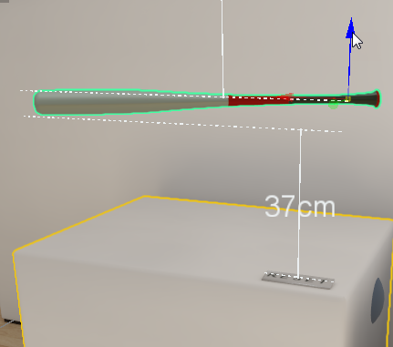
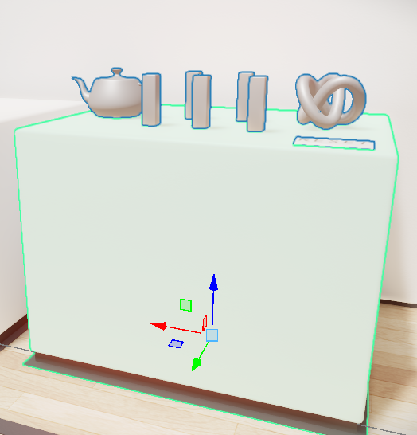
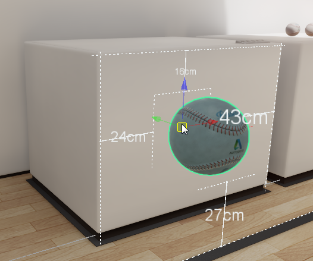
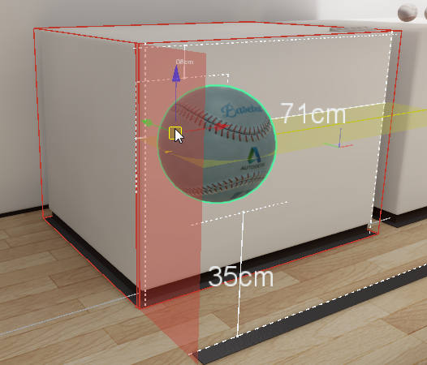

#Smart Placement Tool

The **Smart Placement** tool provides you with an intuitive way to place objects precisely when working in the Level Viewport or editing your scene in VR. This multi-faceted tool lets you snap an object to a surface, align an object, and auto-parent objects. A smart grid lets you measure distances easily, and displays measurements to nearby objects.

The **Smart Placement** tool plugin loads automatically when you launch your project. To manage the following settings, select **Smart Placement > Smart Placement Config** from the main tool bar and toggle **Placement settings** in the window that appears.

###Measurements

When enabled, dragging any object shows measurements to nearby objects in centimeters.

###Auto-parenting

Auto-parents child object(s) that are placed on top of a parent object.

In the following example, several objects are placed on top of a white plinth. When auto-parenting is enabled, the objects placed on top of the plinth (children) are auto-parented to the plinth (parent). All auto-parented objects are outlined in blue and move with the parent.

###Snap Root To Surface

When enabled, dragging an object's root snaps it to neighboring surfaces.

###Snap to Smart Grid

When enabled, the smart grid displays red planes as you drag an object close to a neighboring surface, indicating where your object is snapping.

