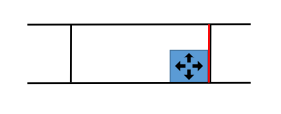
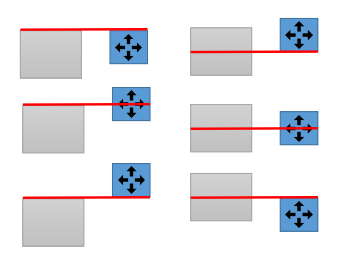
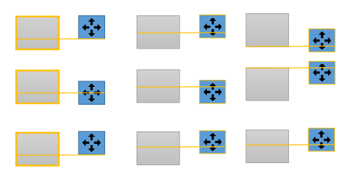
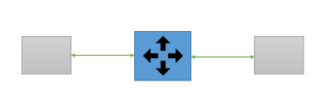
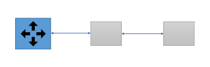

#Smart Placement Tool

The **Smart Placement** tool provides you with an intuitive way to place objects precisely when working in the Level Viewport or editing your scene in VR. This multi-faceted tool lets you snap an object to a surface, align an object, and auto-parent objects. A smart grid lets you measure distances easily, and displays measurements to nearby objects.

The **Smart Placement** and **Smart Surrounding** plugins load automatically when you launch your project. Both of these plugins must be loaded to use the **Smart Placement** tool.

>**Tip:** If you experience crashes when using the **Smart Placement** Tool, ensure that the **Smart Surrounding** plugin is loaded.

From the main menu, select **Smart Placement > Smart Placement Config** from the main tool bar to adjust the **Placement settings** in the window that appears.

>**Important:** The **Placement settings** are disabled by default. You must enable the options manually.

###Measurements

When enabled, dragging any object shows measurements to nearby objects.

###Auto-parenting

Auto-parents child object(s) that are placed on top of a parent object.

In the following example, several objects are placed on top of a white plinth. When auto-parenting is enabled, the objects placed on top of the plinth (children) are auto-parented to the plinth (parent). All auto-parented objects are outlined in blue and move with the parent.

###Snap Root To Surface

When enabled, dragging an object's root snaps it to neighboring surfaces.

###Snap to Smart Grid

When enabled, the smart grid displays snap guides as you drag an object close to a neighboring surface. Red and yellow planes appear on the neighboring surface to show snapping options based on your object's location:

  - Red planes:
    - Aligns to the nearest face of an object if moving inside the object bounding box

    

    - Aligns edges or center of the bounding boxes if moving outside the object

    

  - Yellow planes:
    - Divides faces in to thirds and lets you snap to those points
    - Snap to an object's bounding box
    The following images show examples of alignments to a third of the bounding boxes:

    

  - Green planes:
    - Snaps in the middle of objects

    

  - Blue planes:
    - Snaps to the object below and matches distance between objects
    
    

###Enable Precise Snapping (Slow)

When enabled, snapping locations are computed based on the shape of the neighboring object. The follow example shows that more precise snapping is achieved, even with an irregularly shaped neighboring object.

