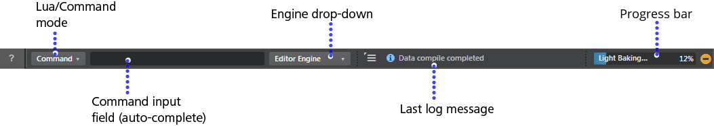
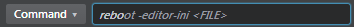

# Status bar

See also: ~{ Send commands from the Status bar }~, ~{ Console commands }~.

At the bottom of the Stingray Editor, the Status bar lets you manipulate instances of the engine using the command input field. The main areas of the Status bar include:

## Lua/Command mode

Click the Lua/Command toggle to switch modes in the Status bar. Set the mode according to how you want to manipulate the engine:

-	In **Lua** mode: Enter short Lua scripts in the input field.

-	In **Command** mode: Enter predefined sets of wrapped Lua scripts (commands).

	See ~{ Console commands }~ for a complete list.

## Command input (auto-complete)

Enter Lua code or console commands in this area.

As you type, the input line auto-completes based on the objects and functions in the Lua API, or the set of predefined commands provided by the engine. Press `Tab` to accept an auto-complete suggestion.

You can then edit the suggestion, and press `Enter` when ready to send the command. To scroll through all suggestions for your current input, press `Tab` or `Shift`+`Tab`.

Stingray stores up to the last 100 commands you enter in the input field, regardless of whether you save the current level. To navigate through the history, click in the input field and press the Up or Down arrow keys. The Status bar automatically switches between Command/Lua mode as you navigate the history. Press `Enter` to send a command from the history.

**Note:** This tool is intended to let you run short, single line blocks of Lua code within the runtime Lua environment for tasks like showing the FPS, selecting objects, and so on. To build Lua scripts into your gameplay, use the **Script Editor**. See ~{ Using the Script Editor }~.

For complete reference documentation on Lua functions, refer to the [Lua API Reference](http://www.autodesk.com/stingray-help?guid=__lua_ref_index_html).

## Engine drop-down

Use this drop-down to select the instance of the engine you want to send commands to. By default, commands are sent to the Editor Engine running on your local PC.

Other instances of the engine are added to this drop-down dynamically. For example, the Test Engine appears when you test play a level or test a project.

##  Last log message

As you work in Stingray, the **Log Console** prints all kinds of status messages, including errors and warnings. In each line, the response or output from the engine is prefixed with the engine name. Next to the input field, the Status bar prints a single line to display the last warning or error printed in the **Log Console**.

-	To clear the last log message, right-click the text area.
-	To configure which types of messages are shown, or to clear the current message, use the Log Output Options menu  to the left of the text area.
-	To open the full ~{ Log Console }~ window and view all engine responses, double-click the text area.

## Progress bar

The right side of the Status bar is reserved for a progress indicator that gives you feedback about the state of ongoing operations such as light baking, data compilation, and level loading.

-	To cancel the current operation, click the yellow  icon (if available).

---
Related topics:
-	~{ Using the Connections panel }~
-	~{ Debugging Lua }~
---
