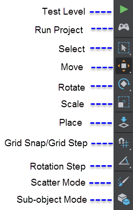

#Toolbar

The Toolbar is located on the left side of the ~{ Level Viewport }~ in the main window of the interactive editor.

<dl>

<dt>Test Level</dt>

<dd>Launches the test engine and the **Test Level** preview window, letting you enter and interact with the world you've been building.</dd>

<dt>Run Project</dt>

<dd>Lets you test the entire project on your PC. See ~{Test and build a project}~.</dd>

<dt>Select</dt>
<dd>Activates the Select tool. Using the Select tool, you can select objects within the marquee selection (**Window** mode) or objects that intersect the marquee selection (**Crossing** mode). See ~{ Select objects in a level  }~. **Hotkey: q**</dd>

<dt>Move</dt>

<dd>Activates the Move tool. Move manipulators display on the selected object. See also ~{ Move, rotate, or scale objects in a level }~. **Hotkey: w**</dd>

<dt>Rotate</dt>

<dd>Activates the Rotate tool. Circular rotate manipulators display on the selected object. See also ~{ Move, rotate, or scale objects in a level }~. **Hotkey: e**</dd>

<dt>Scale</dt>

<dd>Activates the Scale tool. Scale manipulators display on the selected object. See also ~{ Move, rotate, or scale objects in a level }~. **Hotkey: r**</dd>

<dt>Placement</dt>

<dd>Activates the Placement tool. Wireframe of a selected asset displays with the cursor in the **Level Editor**. Click to place instances of the selected unit. See also ~{ Place objects in a level }~. **Hotkey: t**</dd>

<dt>Grid Snap/Grid Step</dt>
<dd>Activates grid snapping, letting you use the move tool to snap an object to the grid, a point, or a surface. See ~{ Snap objects in a level }~.</dd>

<dt>Rotation Step</dt>
<dd>Activates rotation snapping, letting you use the rotate tool to snap an object to the selected angle increment. See ~{ Snap objects in a level }~.</dd>

<dt>Scatter Tool Mode</dt>
<dd>Activates Scatter Tool mode, letting you use the **Scatter Tool** to randomly scatter the selected unit as an array or over the surface of an object. See ~{ Paint with the Scatter Tool }~.</dd>

<dt>Sub-object Mode</dt>
<dd>Activates sub-object mode, letting you use the **Story Editor** to animate a sub-object within a unit. See ~{ Animate sub-objects with the Story Editor }~.</dd>

</dl>

##Tool hotkeys

| Action  | Hotkey |
| ------------- | ------------- |
| Play level  | F8  |
| Place tool  | T |
| Select tool | Q |
| Move (Transform) tool  | W  |
| Toggle World/Local Transform  | (when in Transform mode) W  |
| Rotate tool  | E  |
| Toggle World/Local Rotation  | (when in Rotate mode) E  |
| Scale tool  | R  |
| Toggle Global grid snapping  | X |
| Toggle Rotation angle snapping  | Z |

---
Related topics:
-	~{ Move, rotate, or scale objects in a level }~
-	~{ Place objects in a level }~
- ~{ Select objects in a level }~
---
