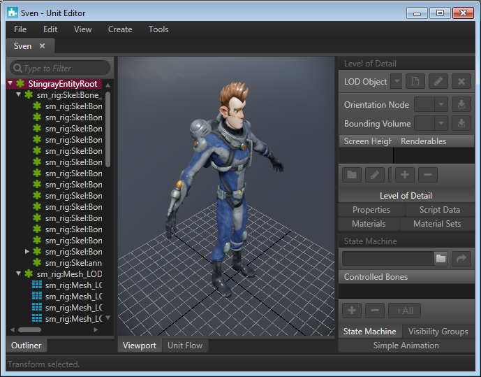
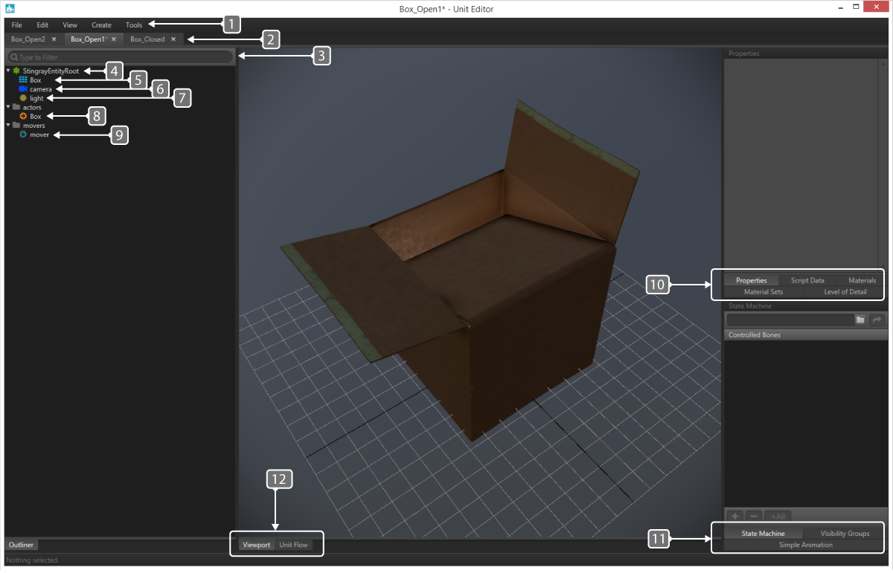
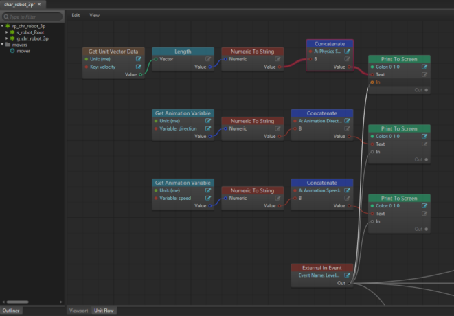
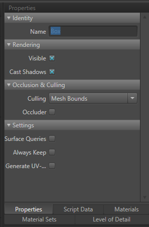
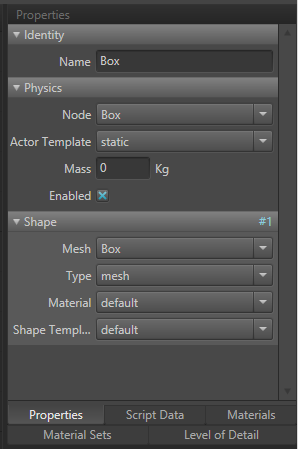
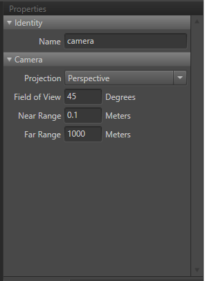
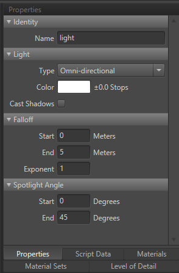
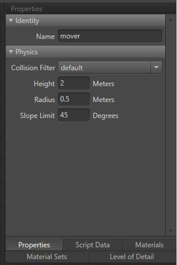

# Unit Editor

- **Window > Unit Editor**

The **Unit Editor** gives you control over many elements of your unit's basic properties and constituent pieces. Because each unit can be made up of multiple meshes, lights, cameras, physics actors, and script data, the **Unit Editor** is an essential tool for managing how the unit and all its parts interact.

The **Unit Editor** works on unit *resources* in your project. Each *.unit* resource is like a template, which you *spawn* in your levels when you want an instance of that unit to show up in the level's 3D scene. You can launch the **Unit Editor** separately from the interactive editor, and work on your units without needing to load a level.

## Unit Editor Overview

The **Unit Editor** has the following feature elements:

1. General Navigation
2. Unit Tabs
3. Filter/Search Bar
4. Green Icons
5. Teal Grid Icon
6. Blue Camera Icons
7. Gold Light Icon
8. Orange Arrow Icons
9. Teal Arrow Icon
10. Unit Definition Tabs
11. Unit Control Panels
12. Display Tabs

### General Navigation

  These tabs contain options for creating and editing units, adding cameras, lights and mover to selected units and so on. (See the complete menu options in ~{Unit Editor: Menu bar}~.)

### Unit Tabs
  - Highlighted tab denotes the currently selected unit.
  - Tabs with an asterisk denote that the unit has unsaved changes.
  - "X" closes the unit.

### Filter/Search bar
  Especially useful on units with numerous entities, typing will refine the unit content list.

### Green Icons
  Denote logical groups. For example: Nodes/Transforms/Bones/Groups

### Teal Grid Icons
  Denote model geometry.

### Blue Camera Icons
  Denote unit cameras.

### Gold Light Icons
Denote unit lights.

### Orange Arrow Icons
Denote actors.

### Teal Arrow Icons
Denote movers.

### Unit Definition Tabs

These tabs are relative specifically to the selected element in your unit.

  - Properties: General Settings (See more in the [Properties panel](#header2) section)
  - Script Data: Create and edit script accessible data keys and values.
  - Materials: Create and edit materials used by the selection.
  - Material Sets: Material sets have been deprecated. Use the **Materials** tab instead.
  - Level of Detail: Allows the user to swap models based on % of screen space used.  (See ~{Unit Editor: LOD panel}~ )

### Unit Control Panels

These controls have relativity to the unit (not the selection).

  - State Machine: Lets you interact with state machine hooks.
  - Visibility Groups: Allows users to toggle visibility of group of objects within the unit.
  - Simple Animation: Used in coordination with the **Story Editor**, this allows for the creation of animation groups. (See the ~{Story Editor}~ for further details)

### Display Tabs
  - Viewport: 3D viewport displaying your selected unit.
  - Unit Flow: Flow control of the unit. (See ~{ Visual programming using Flow }~ for details on unit flow vs. level flow.) This part of the **Unit Editor** lets you create logic specific to a given unit such a character, prop, or other object while it is loaded in the engine. This is useful for doing things like character controls or prop effects.
   

### Outliner

The outliner is a list of all entities present in the selected unit.

## Properties panel {#header2}

The Properties panel will show different properties based on the selection type.  For example, an object will show different properties than an Actor.

### Object/Geometry Properties
When selecting a geometry object, the following panel will be presented in the Properties tab.

*	**Identity**
	* *Name*: Name of the Object/Geometry

*	**Rendering**
 	* *Visible*: Toggles the unit's visibility. Useful for collision meshes or other geometry you don't want seen in your scene.
 	* *Cast Shadows*: Toggles shadow casting for the selected object. An invisible object WILL cast shadows if this selection is toggled on.

*	**Occlusion and Culling**
	* *Culling*
		* Mesh Bounds: Enables the object to be culled based on the meshes bounding box.
    	* Disabled: Disables culling for this object.
	* *Occluder* : Toggles whether this object will be considered for occlusion to cull other objects.

*	**Settings**
	* *Surface Queries*: Enables surface materials for this mesh. Used for decals and sound effect selection.
	* *Always Keep*: When checked, this object will be included in the mesh list even if it does not contribute to the scene.  Used to make hidden meshes accessible from script.
	* *Generate UV's*: When used, this will generate a Unique UV Layout in the object using UV CHannel 2.  Used for light mapping.

### Actor Properties

*	**Identity**
	* *Name*: Identifies the element in the unit.

*	**Physics**
	* *Node*: The scene graph node the element is attached to.
	* *Actor Template*: How the Actor behaves in the world.
		*	Static: Does not move.
    	*	Keyframe: Moves based on keyframed animation.
    	*	Dynamic: Moves using physics system.
	* *Mass*: Sets the mass in kilograms.  0 will approximate mass based on size.
	* *Enabled*: Toggled on to calculate physics for this actor upon spawning.
*	**Shape**
	* *Mesh*: Scene graph mesh to base the physics shape on.
	* *Type*: Physics object used.
	* *Material*: Controls properties such as friction and restitution.
	* *Shape Template*: Controls interactions between physics shapes.

### Camera Properties

*	**Identity**
	* *Name*: Identifies the element in the unit.

*	**Camera**
	* *Projection*: Allows the user to select the class of light.
		* Perspective: Renders with depth scaling.
		* Orthographic: Renders with no depth scaling.
	* *Field of View*: Vertical field of view  in degrees.
	* *Near Range*: Distance to the Near Clip Plane in meters.
	* *Far Range*: Distance to the Far Clip Plane in meters.

### Light Properties

*	**Identity**
	* *Name*: Identifies the element in the unit.

*	**Light**
	* *Type*: Allows the user to select the class of light.
		* Omni Directional: Light is emitted from the center-point and radiates outward at all angles.
		* Spotlight: Light is emitted from the center-point and radiates outward with a specified angle.
	* *Color*: Color of the light.
	* *Cast Shadows*: Allows the user to cast shadows.

*	**Falloff**
	* *Start*: The point at which falloff (fading) begins.
	* *Enabled*: The point at which the falloff ends (fades out).
	* *Exponent*: Controls how the light falls off.  1 = Linear

*	**Spotlight Angle**
	* *Start*: Used to denote what angle the spotlights starting edge is.
	* *End*: Used to denote what angle the spotlight ends with.
	Example: Start = 0, End = 45 will give you a spotlight of 45 degrees.

### Mover Properties

*	**Identity**
	* *Name*: Identifies the element in the unit.

*	**Physics**
	* *Collision Filter*: Objects matching the collision filter will block the mover.
	* *Height*: Height in meters, the mover extends up from the mover root.
	* *Radius*: Radius in meters, the mover is an upright capsule rests on the unit root.
	* *Slope Limit*: The mover can "climb" inclines less steep than this angle.

---
Related topics:
-	~{ Create a physics actor  }~
-	~{ Assign a material to an object }~
---
