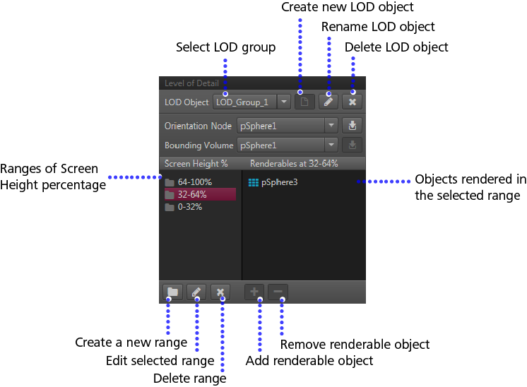

#Unit Editor: LOD panel

In the ~{ Unit Editor }~, the LOD panel lets you add levels, add objects to existing levels, and edit the screen height percentage threshold values.

<dl>

<dt>LOD Object</dt>

<dd>Select an LOD group.
Click the icons next to this drop-down to create, edit, or delete an LOD group.</dd>

<dt>Orientation Node</dt>
<dd>Changes the LOD object's orientation node to the scene graph node pointed to by unit and node.</dd>

<dt>Bounding Volume</dt>
<dd>the bounding volume of the LOD object.</dd>

<dt>Screen Height %</dt>

<dd>A percentage value range at which the specified renderable objects will display.</dd>

<dt>Renderables at (range)</dt>

<dd>Objects that render in the scene when the specified level is active.</dd>

</dl>

---
Related topics:
- ~{ Import and test LODs using FBX }~
---
