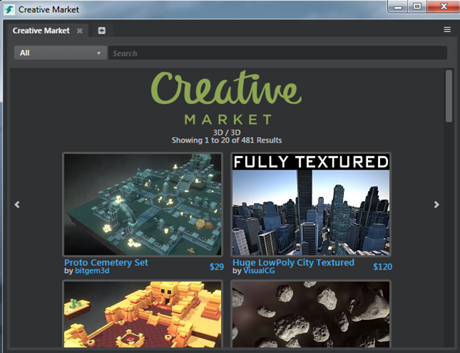

# Download assets and example projects

The template projects available in the ~{ Project Manager }~ provide good starting points for creating your own interactive projects. However, in order to make them as easy as possible to understand and apply, they are intentionally kept relatively lightweight and simplistic. Therefore they only scratch the surface of what is possible with {{ProductName}}.

Sample projects that illustrate the potential of specific elements of {{ProductName}} and example projects that show more complex usage of components like Scaleform Studio, HumanIK and Gameware Navigation are available as online examples. Download these projects using the **Online Examples** tab in the **Project Manager**.

## Download online assets

Browse and import free online assets using the **Online Assets** folder in the ~{ Asset Browser }~. Right-click an asset in the Asset Browser and select **Download Asset** to download and import the asset package to a category specific folder in your project.

You can also select an asset and click the Download button in the **Property Editor** to download the asset.

## Purchase assets from Creative Market

Visit the [Creative Market](http://www.autodesk.com/stingray-creativemarket-samples) store to purchase a variety of 3D assets created by the community for use in your projects, or to sell your own creations.

You can browse these assets inside the interactive editor, using the **Creative Market** panel (**Window > Creative Market**).

---
Related topics:
-	~{ Set up a project }~
-	~{ HumanIK sample project and common use cases }~
-	~{ Open an existing project }~
---
