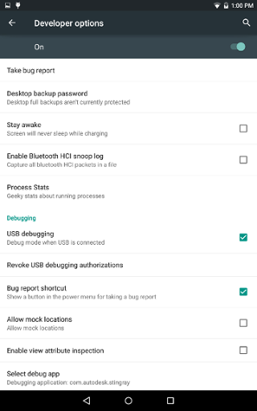
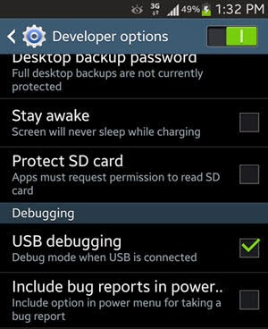
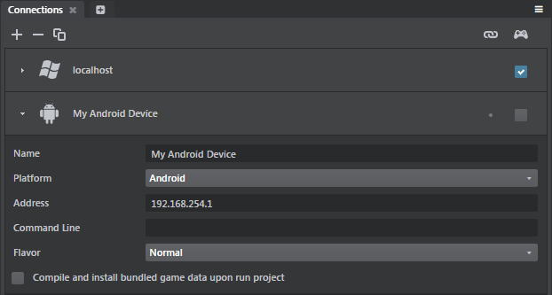

# Get started on Android

This page tells you everything you need to know in order to get started developing projects for Android. You'll need an Android device to follow along.

## Step 1. Check the supported devices

See the ~{ Supported platforms }~ page for details on the Android devices and OS versions that the interactive engine can work with, and make sure your device is a good fit.

## Step 2. First-time setup

You'll have to install and set up a few things on the Windows machine that you use to run the interactive editor.

### Install Java

You need both the Java Development Kit (JDK) and the Java Runtime Environment (JRE).

{{ProductName}} requires at least version 7, but we recommend using the latest update of version 8.

You can download the JDK from the [Oracle Java SE site](http://www.oracle.com/technetwork/java/javase/downloads/jdk8-downloads-2133151.html). The JDK package contains a full version of the JRE, so you should not have to install the JRE separately.

### Install the Android SDK and tools

If you don't already have the Android SDK installed on your computer,

1.	Download the Android Standalone Tools: <https://dl.google.com/android/repository/tools_r25.2.3-windows.zip>
1.	Unzip the package, and run `tools/android.bat` to launch the Android SDK Manager.
1.	In the SDK Manager, install the following:
    - Android 7.1.1 SDK Platform (API 25)
    - Android 5.0 SDK Platform (API 21)
    - Android SDK Tools 25.2
    - Android SDK Platform-tools 27
    - Android SDK Build-tools 25

### Check your environment variables

After you install Java and the Android SDK:

-	Make sure that the `JAVA_HOME` environment variable is set to point to the correct installation folder. For example, `C:\Program Files\Java\jdk1.8.0_80`.
-	Make sure that the `ANDROID_HOME` environment variable is set to point to the correct installation folder. For example, `C:\Program Files (x86)\Android\android-sdk`. The folder you set here should already contain several sub-folders, including `add-ons`, `build-tools`, `extras`, `platforms`, `platform-tools`, `sources`, `system-images`, and `tools`.
-	Find the `adb.exe` tool in your Android SDK installation directory, and add its location to your `PATH` environment variable. This tool is typically found under `%ANDROID_HOME%\platform-tools`, but it may be in a different location on your system. For example, `D:\android\tools_r25.2.3-windows\platform-tools`.

### Make a default keystore for app signing

When you deploy a project to a standalone *.apk* application, the deployer needs to sign your app using a keystore that you have set up on your system. If you do not specify a keystore when you deploy, the deployer relies on a default "debug" keystore. Most versions of the Android SDK generate this default keystore automatically when you install the Android SDK, but some may not.

Look for the default keystore at this location: `C:\Users\<username>\.android\debug.keystore`.

If the `debug.keystore` file is not present on your system, run the following command at a command prompt to create it manually:

~~~{nohighlight}
> "%JAVA_HOME%\bin\keytool.exe" -genkey -v -keystore "%USERPROFILE%/.android/debug.keystore" -storepass android -alias androiddebugkey -keypass android -dname "CN=Android Debug,O=Android,C=US" -validity 10000 -keyalg RSA
~~~

Note that the debug keystore expires 365 days after creation. If your default keystore has expired, delete the `debug.keystore` file and re-create it using the command line above. See also the [Android developer help](http://developer.android.com/tools/publishing/app-signing.html).

### Set up your Android Debug Bridge USB drivers

In order to connect the interactive editor to your device over a USB connection, or to install apps to your device using the Android Debug Bridge, you need to have USB drivers installed on your computer that are compatible with your device.

Which drivers you should use, and how to install those drivers, depends on the make and model of your Android device.

For details, check your device manufacturer's documentation or support site, or consult the official [Android developer site](http://developer.android.com/tools/extras/oem-usb.html).

### Restart

After installing the prerequisites and setting the environment variables listed above, restart your computer.

## Step 3. Connect the editor to the device

Connecting the editor to your device has two benefits:

-	You can mirror the editor's viewport to the device while you're working on your project content, so that you have a live preview of what your changes look like on the device.

-	You can easily run your project on the device to test your gameplay.

For more background information, see ~{ Connect to a remote device }~.

**To connect to an Android device:**

1.	Plug your device in to a USB port on your Windows machine.

1.	Enable USB debugging on the Android device. This is typically found in the device's Settings, under **Developer options**. Two examples:

	 

	If you don't see the **Developer options** on your device, you may need to enable them. Find the Android **Build number** in the device's settings, and tap the build number seven times.

1.	In the interactive editor, use the **Connections** panel (**Windows > Deploy and Connect > Connections**) to set up a connection to the Android device:

	

	For details, see ~{ Using the Connections panel }~.

	>	**Note:** In the *Address* field of the **Connections** panel, you must enter the IP address of your Android device. You can find this in your device's settings.

When you connect to the device or run the project, the editor automatically installs the engine on the device over the USB connection, runs the engine on the device, then sends your project data to the engine.

>	**Tip:** If you're unable to connect to your Android device, you may need to install ADB drivers specific to your device and try the procedure again.

## Step 4. Deploy the project for Android

Deploying creates a standalone *.apk* bundle that you can try out on your device (and, eventually, distribute on the Google store). For background information, see ~{ Deploying and Building }~ and ~{ Using the Deployer panel }~.

**To package a project for Android:**

1.	In the interactive engine, open the **Deployer** panel (**Windows > Deploy and Connect > Deployer**) to the Android tab and enter the required information. (See below.)
1.	Click **Package Project for Android**.

The deployer creates an *.apk* file for your app, and copies it to the location on your computer that you specify in the **Destination** field.

**After deploying:**

-	To copy your deployed app to a connected device for testing, use the `adb` utility. You can find this tool in your Android SDK installation folder, under the `/platform-tools/` sub-directory. Connect your device to the computer by USB, open a command prompt, and type:

	`adb install <path-to-apk>`

-	To distribute your app on the Google Play store, use the tools provided by Google. See the [Developer Console Help](https://support.google.com/googleplay/android-developer/answer/113469?hl=en) for more information on the Google Play Developer Console.

### Android deployment settings

You can set the following options in the **Deployer** panel for Android devices.

### Packaging settings

These settings are common for all tabs. See ~{ Using the Deployer panel }~.

### General settings

<dl>
<dt>Title</dt>
<dd>The title of your project. This sets the name of the executable file for the application, and the product name for online stores.</dd>
</dl>

### Identity settings

<dl>
<dt>Identifier</dt>
<dd>The unique process name of your application. It contains two parts separated by a dot.</dd>

<dt>Version Code</dt>
<dd>An internal version number used by Google store to distinguish between version upgrades.</dd>

<dt>Version Name</dt>
<dd>The version number, in two-part notation, that is displayed in your application, for example 1.25.</dd>

<dt>Android flavor</dt>
<dd>There are three different builds of the interactive engine for Android: a regular build, a build that plays content on Gear VR devices, and a build that plays content on Google VR devices. Use this control to choose which of these engine flavors are included in your package.</dd>
</dl>

### Icons settings

Browse to select your app icon in PNG format. It can be any size, but we recommend a maximum of 512x512 pixels. If you leave this empty, the **Deployer** uses a default Autodesk icon.

### Keystore Signing settings

Keystore signing is required in order to test the generated *.apk* file on a device or publish it on the store. If you don't enable the **Keystore Signing** section, the editor automatically uses the `debug.keystore` that is installed at the same time as the Android SDK at `%USERPROFILE%/.android/debug.keystore`.

<dl>
<dt>File</dt>
<dd>The location of the custom keystore file.</dd>

<dt>Password</dt>
<dd>The keystore password.</dd>

<dt>Alias</dt>
<dd>Provide the keystore alias if required.</dd>

<dt>Alias Password</dt>
<dd>The alias password if required.</dd>

</dd>
</dl>

For more information on keystore signing, see the [Android documentation](http://developer.android.com/tools/publishing/app-signing.html).

## Step 5. Keep your content optimized!

Mobile devices don't have the same amount of memory and processor resources to throw at your project as your PC does. When you're making a project that you intend to be used on mobile platforms, it's really critical to pay close attention to the size of your resources and the overall demands that the project is putting on the device.

For some helpful tips, see ~{ Optimize memory usage }~.
