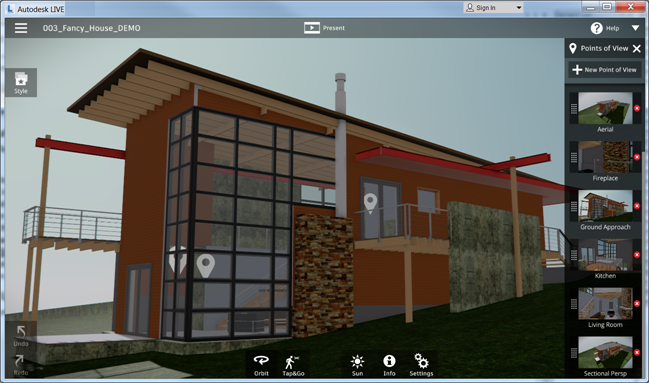

# Get started with the Live template

The **Live** template is an interactive project that offers all the runtime features of Autodesk Live, but without any content. Start a project from this template, bring in your own custom models and materials, and you can deploy your own customized Live experience.

In this project, you will find all the scripts and runtime content that make the Live experience work. All of the runtime logic is handled by the Lua scripts that you'll find in the `script/lua` folder in the Live template. This documentation doesn't cover everything in detail, so feel free to dig into the gameplay scripts project to see how things work under the hood!

**To get started:**

1.	Create your new project.

	In the 3ds Max Interactive editor, open the **Project Manager** to the **Online Projects** tab. Select the **Live** template, click **Download**, and follow the instructions.

	

	For details, see the topics under ~{ Set up a project }~.

1.	Open the `content/levels/empty.level` level, if it's not already open. This is the default level you'll want to use for adding your own content.

	>	**Tip:** You can change this default level for your project. See ~{ Change the default level for the Live template }~.

1.	Import some content into your project.

	You import content for the Live template in exactly the same way as any other 3ds Max Interactive project -- for example, for 3D models, you'll typically use the FBX interchange format. For more information on this topic, see the topics under ~{ Importing Assets }~.

1.	Add your own content to your project's default level.

	Once you have imported your content into your project, you can simply drag and drop it from the **Asset Browser** to the **Level Viewport** to place it into your default level. For more information on how to build a scene in the 3ds Max Interactive editor, see the topics under ~{ Building Levels }~.

1.	Set up your content so that it will work with the runtime features of the Live template. At a minimum, you'll want to make sure that your main models have physics set up, and that you generate the navigation data that the "tap and go" movement mode depends on.

	See ~{ Set up the Live template }~.

	You can also experiment with a variety of other optional configuration settings to control the way0 your project behaves when you launch it. For details, see ~{ Live settings }~.

1.	Run your project and try it out! Click  to run the project from the 3ds Max Interactive editor, or use the **Deployer** panel to create a standalone `.exe` or mobile app.

	See ~{ Deploying and Building }~, and the platform-specific topics under ~{ Getting Started }~.
