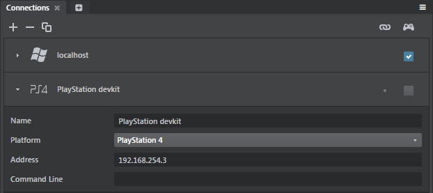
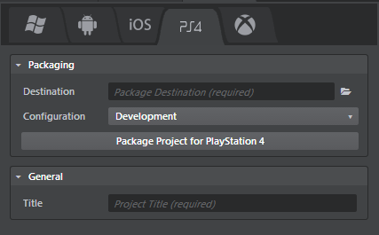

# Get started on PlayStation 4

This page tells you everything you need to know in order to get started developing projects for PlayStation 4. You'll need to be a registered PlayStation 4 developer with Sony already, and you'll need a devkit to follow along.

## Step 1. First-time setup

You'll have to install and set up a few things on the Windows machine that you use to run the interactive editor.

### Install the {{ProductName}} PlayStation 4 distribution

The parts of {{ProductName}} related to PlayStation 4 are only distributed to teams that are registered with Sony as PlayStation 4 developers. You need to get this distribution and install it on your computer.

Registered PlayStation 4 developers can download the distribution from the Autodesk Game Developer Center, at <http://gamedev.autodesk.com/releases>. Make sure that you download the version that matches the version of {{ProductName}} that you have installed on your Windows machine.

If you need to register for an account, or if you need to add PlayStation 4 access rights to your existing account, you can do so through the site.

Once you have the distribution *.zip* file on your computer, unzip it into your {{ProductName}} installation folder. Make sure that the contents of its `engine` folder are merged into the `engine` folder that is already present in your installation folder.

### Install the PlayStation 4 platform SDK

If you want to connect your Windows development machine to your PlayStation 4 for mirroring or running your project, you need to install the PlayStation 4 platform SDK.

You need **version {{SR_DOC_PS4_SDK_VERSION}}**. Other versions may or may not be compatible.

You can get the SDK using the SDK Manager utility, available to registered developers on the Sony DevNet: <https://ps4.scedev.net/>.

The editor does not require the SDK in order to deploy or package your game, although you may need it in order to prepare your final distribution.

## Step 2. Connect the editor to the device

Connecting the editor to your device has two benefits:

-	You can mirror the editor's viewport to the device while you're working on your project content, so that you have a live preview of what your changes look like on the device.

-	You can easily run your project on the device to test your gameplay.

For more background information, see ~{ Connect to a remote device }~.

**To connect to a PlayStation 4:**

In the interactive editor, use the **Connections** panel (**Window > Deploy and Connect > Connections**) to set up a connection to the PlayStation 4 device:

For details, see ~{ Using the Connections panel }~.

When you connect to the device or run the project, the editor automatically installs the engine on the device over the network, runs the engine on the device, then sends your project data to the engine.

### Troubleshoot connecting to PS4

In some cases when connecting to a PS4, you may encounter errors like the following:

> Connections: Failed to connect to "PS4". Please ensure the PlayStation 4 engine run-time can be accessed at <IP address>. Error Invalid DevKit: <IP Address>'

> [INFO] No DevKits found

We recommend the following troubleshooting steps:

- On the PS4 system, make sure that the  Debug Settings > Network > Network Interface **Selection** setting is set to **Routing Information** and not **Always LAN**.

- Make sure that the devkit has not expired.

- Check that your IP settings are correct both in the **Deployer** and on the device.

## Step 3. Deploy the project for PlayStation 4

Deploying creates a standalone bundle that you can try out on your PlayStation 4 (and, eventually, distribute). For background information, see ~{ Deploying and Building }~ and ~{ Using the Deployer panel }~.

**To package a project for PlayStation 4:**

1.	In the interactive editor, open the **Deployer** panel (**Window > Deploy and Connect > Deployer**) to the PlayStation 4 tab and enter the required information. (See below.)
2.	Click **Package Project for PlayStation 4**.

The deployer copies the files your game needs to the location on your computer that you specify in the **Destination** field.

After deploying, you can use the development tools provided by Sony to copy your game to a PlayStation device for testing, and to finish preparing your game for distribution using any of the channels supported by Sony.

### PlayStation 4 deployment settings

You can set the following options in the **Deployer** panel for PlayStation 4 devices.

### Packaging settings

These settings are common for all tabs. See ~{ Using the Deployer panel }~.

### General settings
<dl>
<dt>Title</dt>

<dd>The title of your project. This sets the name of the executable file for the application, and the product name for online stores.</dd>
</dl>
