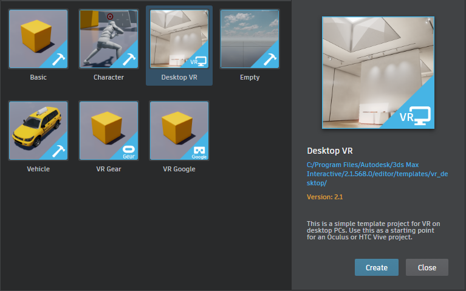

# Get started in VR

The {{ProductName}} editor ships with a few sample projects to help you get started with VR, including templates for HTC Vive, Oculus Rift and mobile VR devices. These projects contain some extra content specific to each VR device -- like Lua scripts, Flow nodes, and controller models -- and are pre-set with appropriate project settings.

The best way to start a new VR project is to start from one of these VR templates, shown in the **Templates** tab of the ~{ Project Manager }~, instead of trying to alter an existing project to make it work in VR.

In {{ProductName}}, you can build your desired behaviors and mechanisms using either Lua or the visual node-based Flow scripting language. The Oculus and Vive templates have an almost one-to-one Lua API, as well as a very similar set of Flow nodes.

The VR templates come with premade functionality built in Flow for doing things like picking up objects, teleporting, playing sound effects, and setting up controller units. These Flow graphs are encapsulated in their own Unit objects. Load those projects and take a look, or check out ~{ VR Flow nodes }~ for an introduction.
