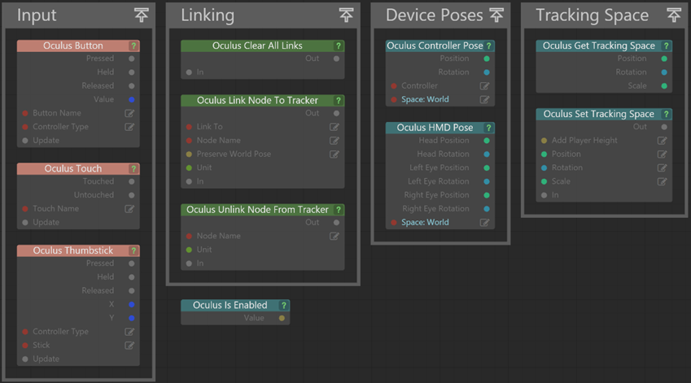

# VR Flow nodes

Each VR template project adds some new Flow nodes, which are only available in that project. This page introduces these VR-specific nodes.

For reference information on all the other Flow nodes available in the interactive engine and its built-in plugins, go to the [Flow Node Reference](../../../flow_ref/index.html).

## General VR Flow node descriptions

- Input nodes

    Used for button presses, touch input, or haptic feedback.

- Linking nodes

    Used for attaching objects in your scene to the devices that are tracked by the VR system, like your controllers or HMD (Head Mounted Display).

- Device Pose nodes

    Provide information about where your tracked devices are located and how they are oriented.

- Tracking Space nodes

    Used for mapping the real-world tracking space defined by your VR system into the virtual environment of your project.

- Effect nodes (HTC Vive only)

    Let you create simple Fade In/Fade Out effects.

Although there are a few discrepancies between the Oculus nodes and the Vive nodes, most of the essential functionalities remain the same. These nodes, in conjunction with the other default Flow nodes, cover all of the functionality necessary to implement any behavior you want for either device.

## SteamVR Flow node

The following Flow nodes are available in the VR HTC Vive template:

## Oculus Flow nodes

The following Flow nodes are available in the Oculus template:

