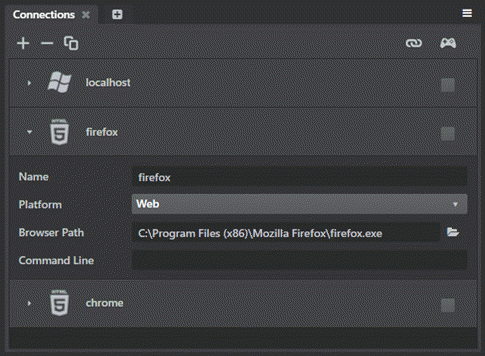
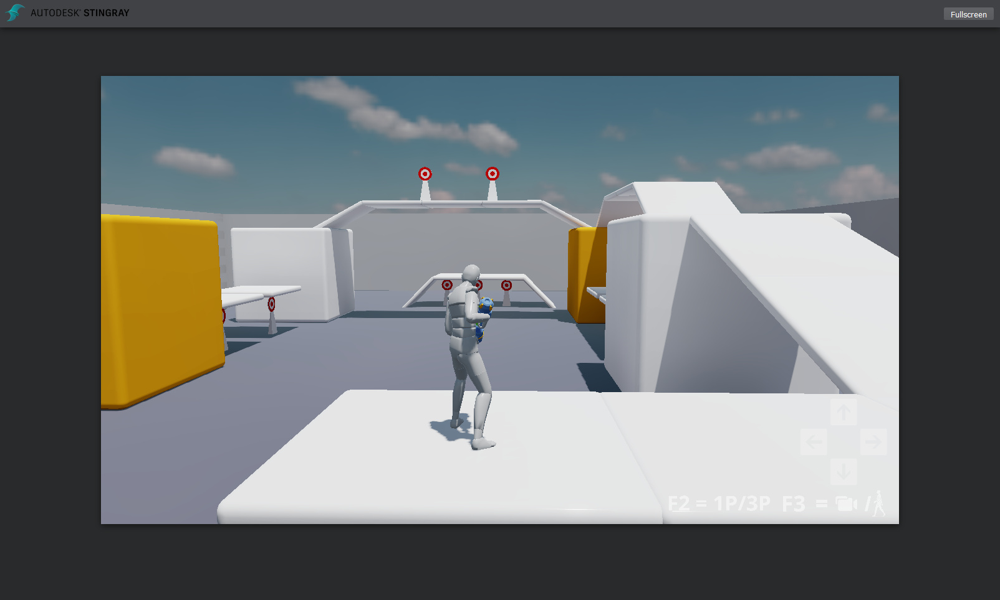
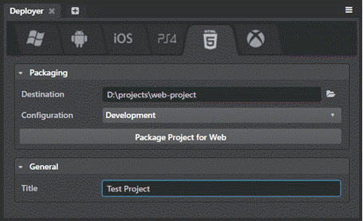

# Приступая к работе с Web

Эти страницы сообщают вам все, что вам нужно знать, чтобы начать разработку проектов, которые будут выполняться в web браузере.

В этом релизе вы можете:

-	Запустить свой проект в браузере прямо из интерактивного редактора.
-	Разверните проект на диск и разместите его на веб-сервере позже..

Вы еще не можете:

-	Mirror the editor viewport to the browser.
-	Run the editor or any of its tools in the browser to edit your levels and projects.

In addition, you may notice that not all of the rendering settings offered by the shading environment are available yet when the project is running in the browser. We're still working on making more of these high-quality effects work under WebGL.

## Шаг 1. Установка поддерживаемого браузера

web версия interactive engine требует **оба** WebAssembly и WebGL 2.0, которые сейчас поддерживаются:

-	Google Chrome (Версия 57 и выше)
-	Mozilla Firefox (Версия 52 и выше)

## Шаг 2. Запуск проекта в web браузере

Для запуска проекта в браузере из редактора interactive, используйте панель **Connections** для настройки нового web target для каждого используемого браузера. (См. также ~{ Использование панели Connections }~.)

1. В панели **Connections** (**Window > Deploy and Connect > Connections**), укажите имя идентифицирующее connection.

1. Задайте опцию **Platform** как **Web**.

1. **Browser Path** укажите путь к *.exe* файлу вашего браузера. Если брайзер не поддерживается (см. список выше), you'll need to browse your file system to select the *.exe* of the supported web browser you want to use.

1. Оставьте **Command Line** пустым. Для web connections, this defines extra parameters that are sent to the launched HTML page in the URL search string. These command-line parameters will be passed to the URL as GET parameters, which are then read by the engine and honored just like any platforms. If you want to customize the HTML page, enter the parameters here. Note that parameters that won’t make sense in the context of a web page might not yield the intended results.

	

1. Нажмите кнопку **Run Project** на панели **Connections** или на viewport tool bar.

Когда проект успешно запущен в browser, он выглядит примерно так:

## Шаг 3. Развертывание проекта на диск

Для этого (чтобы подготовить его у хостингу на web сервере), используйте панель **Deployer** . Перейдите во вкладку **HTML5** icon, задайте нужные поля, и кликните **Package Project for Web**.

См такжеo ~{ Using the Deployer panel }~.

## О web project output

После развертывания, вы найдете следующие файлы в папке **Destination** которую настроили панели **Deployer** :

-	 *.wasm* и a *.js* файлы которые по сути является результатом компиляции среды выполнения WebAssembly, с некоторым JavaScript клеем. (Независимо от того, выполняете ли вы проект из интерактивного редактора или развертываете на диск, для обеих задач используются одни и те же бинарные файлы ядра.)

-	Обертки *.html* котрая загружает движок WebAssembly и JavaScript файлы и поручает ему запустить ваш проект. Эта страница по умолчанию имеет фирменные логотипы по умолчанию, но вы можете настроить ее свободно, если хотите, или использовать ее в качестве модели для написания собственных HTML wrapper page.

-	Папка *scripts* которая содержит дополнительные JavaScript файлы необходимые для корректной инициализации движка. Они также могут быть настроены по желанию.

-	Папка *content* которая содержит скомпилированные данные вашего проекта. Если вы использовали **Deployer** для упаковки проекта web, данные проекта аггрегируются в *bundles*, также как и для других платформ. См. Также ~{ About the content lifecycle }~.

**Запуск развернутого проекта в браузере:**

Разместите содержимого папки назначения на web server, и перейдите на *.html* wrapper through an HTTP connection.

>	**NOTE:** You cannot simply open the *.html* wrapper file in a browser directly from your computer's file system. Due to security concerns, most browsers restrict the types of content they will load and run from `file://` URLs on the local disk or a shared drive.

## О процессе запуска

Starting up the {{ProductName}} engine in the browser is a multi-step process. This sequence happens automatically without you needing to do anything, but it can be helpful to know a bit about what's happening behind the scenes.

1.	**Downloading**. In this step, the browser is downloading and compiling the engine's runtime *.wasm* and *.js* files. The actual project data is *not* downloaded in this step.

	The first time you run a project in the browser, this step can take some time to complete. Subsequent launches usually go faster.

	The speed of the connection will affect the time of this step, as well as how fast your CPU can compile the WebAssembly and JavaScript files.

	In order to save time downloading the same content the next time you load the page, the engine stores the downloaded content in your browser's IndexedDB local storage. (This can speed things up especially if you're running the project on a remote server.) You may find that you need to clear this cache from your browser if you're not seeing updates to your content as expected.

1.	**Syncing resources**. In this step, your project's data is either downloaded from the remote, or loaded from your browser's IndexedDB local storage.

	The first time you run a project in the browser, all files will not exist in the browser's IndexedDB local storage, so they will all be downloaded from the remote.

	On subsequent launches, most (if not all) files should be found in your IndexedDB local storage, essentially eliminating any downloads from the remote, greatly speeding up this step. Note that every browser imposes different limits on the IndexedDB local storage, so it is entirely possible some larger files or projects may fail to properly persist in the IndexedDB local storage.

1.	**Loading resources**. In this step, the engine is running and actually loading your project's resources into memory.

	The time this step takes to complete depends on the amount of content in your project, and what kinds of resources you're loading.

	For example, materials tend to take a long time to load up, so projects with many materials will have a longer wait here. This is because shaders making up these materials need to be compiled at run-time on this platform, but subsequent runs usually go faster when browsers have shader cache features built in.

## Troubleshooting tips

If your project doesn't run in the browser:

-	Make sure you are using a browser that supports **both** WebAssembly and WebGL 2.0 as specified above.

-	Make sure you're accessing your project's *.html* page through a web server, not by loading it directly from your computer's file system.

-	If you have a problem launching from the **Connections** panel, double-check that your **Browser path** points to the *.exe* of your browser and not any other files.

-	In the browser, typically you can press **F12** to open the developer tools.

	The **Console** tab in the developer tools lists any errors the browser encountered when trying to open the project. It also lists any messages that the engine writes to the log while running your project. This can sometimes be helpful in diagnosing where a problem occurs.

- Here are some of the errors we've heard about, and how to fix them:

	-	**Error:** "Failed to create WebGL 2.0 context"

		**Solution:** Generally this means either your web browser does not support WebGL 2.0, the feature is disabled in its configuration, your video card driver is out-of-date, or your device has more than one graphic adapter and the wrong one is being used by the web browser. In any case, you can always try other web sites to confirm whether WebGL 2.0 works on your computer.

	-	**Error:** "Out of memory"

		**Solution:** Too much memory was requested by your project. This happens much more frequently with 32-bit browsers, try a 64-bit web browser instead. Also keep in mind reducing the memory footprint of your project by using texture compression and other techniques always helps as well.

-	Have you run into a different problem? Let us know about it [on the forum](http://www.autodesk.com/stingray-forums).
