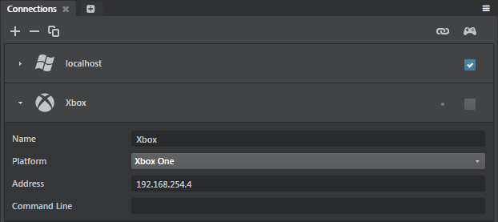

# Get started on Xbox One

This page tells you everything you need to know in order to get started developing projects for Xbox One. You'll need to be a registered Xbox One developer with Microsoft already, and you'll need an Xbox One in developer mode to follow along.

## Step 1. First-time setup

You'll have to install and set up a few things on the Windows machine that you use to run the interactive editor.

### Install the {{ProductName}} Xbox One distribution

The parts of {{ProductName}} related to Xbox One are only distributed to teams that are registered with Microsoft as Xbox One developers. You need to get this distribution and install it on your computer.

Registered Xbox One developers can download the distribution from the Autodesk Game Developer Center, at <http://gamedev.autodesk.com/releases>.  Make sure that you download the version that matches the version of {{ProductName}} that you have installed on your Windows machine.

If you need to register for an account, or if you need to add Xbox One access rights to your account, you can do so through the site.

Once you have the distribution *.zip* file on your computer, unzip it into your {{ProductName}} installation folder. Make sure that the contents of its `engine` folder are merged into the `engine` folder that is already present in your installation folder.

### Install the Xbox One platform SDK

On your Windows development machine, install the XDK: the Xbox One platform libraries. You need the **{{SR_DOC_XDK_VERSION}}** release. Other versions may or may not be compatible.

You can download the SDK from the Microsoft Game Developer Network Portal, available to registered developers at <https://developer.xboxlive.com/>.

## Step 2. Connect the editor to the device

Connecting the editor to your device has two benefits:

-	You can mirror the editor's viewport to the device while you're working on your project content, so that you have a live preview of what your changes look like on the device.

-	You can easily run your project on the device to test your gameplay.

For more background information, see ~{ Connect to a remote device }~.

**To connect to an Xbox One:**

In the interactive editor, use the **Connections** panel (**Window > Deploy and Connect > Connections**) to set up a connection to the Xbox One device:

For details, see ~{ Using the Connections panel }~.

>	**Note:** In the *Address* field of the **Connections** panel, enter the "Console IP" of your Xbox One device. Do not use the "Tools IP".

When you connect the editor to the Xbox One device, the editor automatically sends the engine to the device over the network, runs the engine on the device, then sends your project data to the engine.

## Step 3. Deploy the project for Xbox One

Deploying creates a standalone bundle that you can try out on your Xbox One (and, eventually, distribute). For background information, see ~{ Deploying and Building }~ and ~{ Using the Deployer panel }~.

**To package a project for Xbox One:**

1.	In the interactive editor, open the **Deployer** panel (**Window > Deploy and Connect > Deployer**) to the Xbox tab and enter the required information. (See below.)
2.	Click **Package Project for Xbox One**.

The deployer copies the files your app needs to the location on your computer that you specify in the **Destination** field.

After deploying, you can use the development tools provided by Microsoft to copy your app to an Xbox One device for testing, and to finish preparing your app for distribution using any of the channels supported by Microsoft.

### Xbox One deployment settings

You can set the following options in the **Deployer** panel for Xbox One devices.

### Packaging settings

These settings are common for all tabs. See ~{ Using the Deployer panel }~.

### General settings
<dl>
<dt>Title</dt>

<dd>The title of your project. This sets the name of the executable file for the application, and the product name for online stores.</dd>
</dl>
