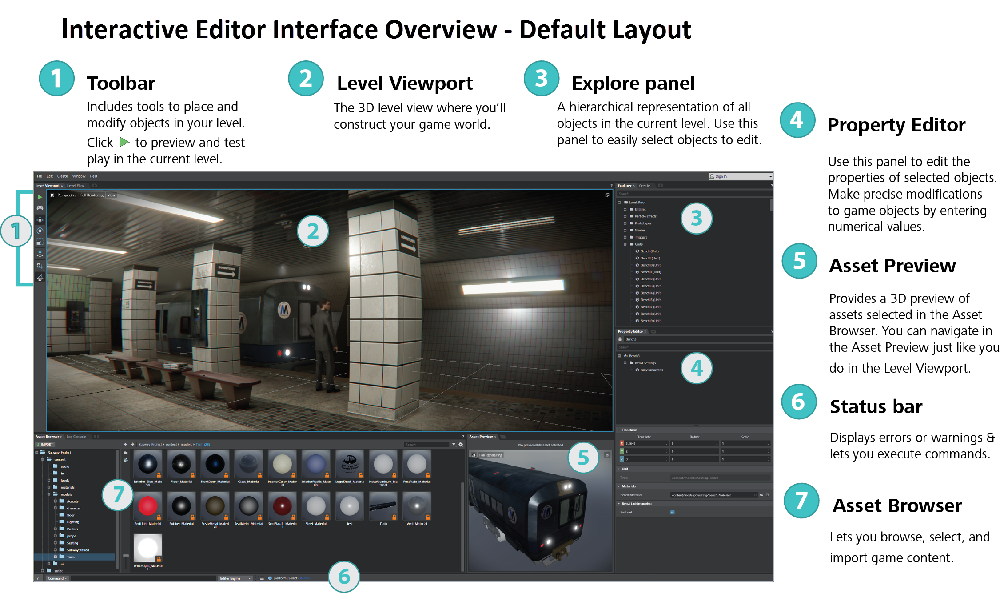

# Interface overview

> **Tip:** You can freely drag, drop, and rearrange the windows in the interactive editor. If you ever want to restore the default configuration shown above, select **Window > Layout > Reset Layout** from the main menu.

---
Related topics:

- ~{ Toolbar }~
- ~{ Level Viewport }~
- ~{ Explorer panel }~
- ~{ Property Editor }~
- ~{ Asset Preview }~
- ~{ Status bar }~
- ~{ Asset Browser }~

---
