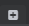

# Customize the layout

See ~{ Interface overview }~ for a tour of the default layout of the Stingray Editor.

| To:  | Do this: |
| ------------- | ------------- |
| Open or close an instance of a tool.  | Click  to close any instance of the tool in the current layout.  |
| Dock a window or tool as a tab in the main interface.  | Drag the tab of the tool to a new location, then drop it next to any other tab. |
| Add a closed window back to the layout.  | Select tools from the **Window** menu, or click  to select and add a tool as a new tab.  **Note:** Only the tools listed when you click this new tab button can be docked in the Stingray layout. External tools and utilities can’t be docked. |
| Restore the default layout. |  Select **Window > Reset Layout**.  |
| Save or load a custom layout.  | Select **Window > Save Layout** and **Window > Load Layout**.  |
