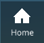

# Modify the Live Home view

When you start a project based on the Live template, the viewport starts up in the **Home** view.

(This is also the first item in the list of viewpoints that you can open by pressing the Views icon.)

The Live template typically places the Home viewpoint automatically so that all of the important units that you've placed in the scene are visible. However, you can influence the default placement if you want to pick and choose which units should and should not be visible.

To do this, you need to assign a category name to each unit you want to include or exclude, then set whether the Home view should include the units assigned to each of those categories.

Models that come to 3ds Max Interactive through the Revit Live service will often be tagged with one of a preset list of category names, like `Roofs` or `Walls`. However, if you are adding your own custom content to the Live template, you will probably have to assign the category yourself using the instructions below.

**To assign a category to a unit:**

1.	Open your unit in the ~{ Unit Editor }~ by double-clicking it in the ~{ Asset Browser }~.

1.	Open the **Script Data** tab on the right side of the Unit Editor.

1.	Click the **+** icon to add a new script data of type `string`.

	In the **Key** column, set the name to `Category Name`.

	In the **Default Value** column, set the value to the name of the category you want to assign to your unit. This can be any of the preset values that you'll find in the `settings/vr_settings.ini` file (see below), or any other value you want.

1.	Save the changes to your unit.

**To set the visibility of a category:**

1.	Open the `settings/components_settings.ini` file in the 3ds Max Interactive **Script Editor** or in a text editor.

1.	Find the `BoundingBox.family_filters` setting (around line 9). This setting contains a list of category names, along with the visibility of that category in the Home view.

1.	If your category name isn't already listed here already, add a new line and change the category name in the new line to match the category name you assigned to your unit.

	Set the values of all the categories to `true` to include them in the Home view, or `false` to exclude them.

**Example**

For example, say that you have a building that you want to include in the Home view's bounding box. You can start by adding a new category name to the `BoundingBox` list:

Then you would open building's `.unit` resource in the **Unit Editor** and set up a new `Category Name` script data key with a matching value:

This tells the Live template that all units of this type in the scene are in the `town_houses` category. The line you added to the `components_settings.ini` file tells Live that all units in the `town_houses` category should be included in the Home view.

>	**Tip:** To view the bounding box computed by the Live project, press `Ctrl+Alt+D` while the project is running. This opens the Debug Menu. Select "Bounding Box" to see the bounding box outlined in white. It should enclose all the units that match the categories you've enabled in the `components_settings.ini` file.
