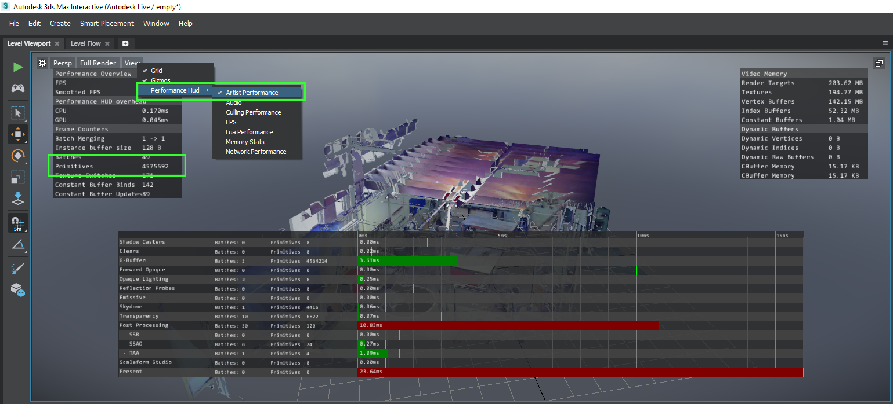
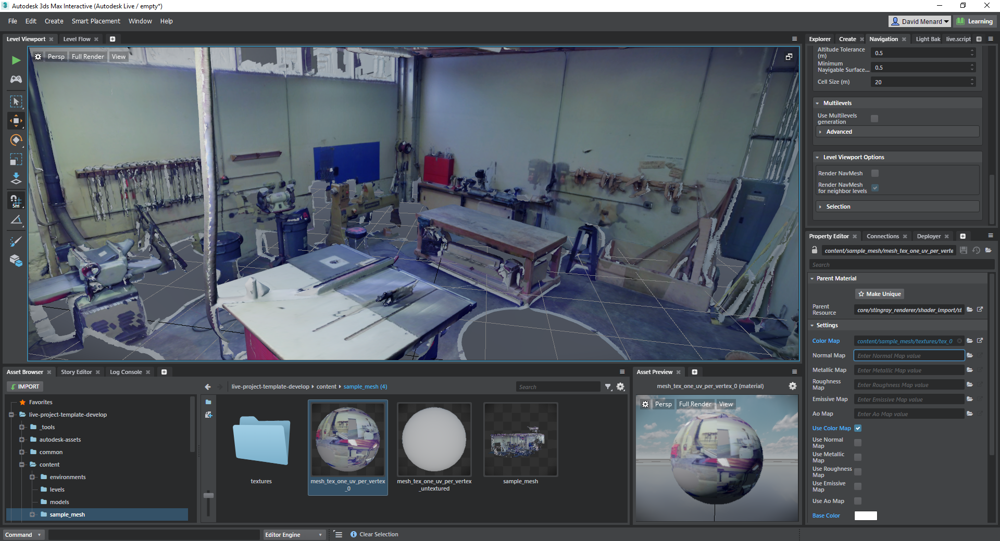

# Import scanned point cloud data into the Live template

Importing point cloud data into 3ds Max Interactive is not much different from importing any other content, but there are certain things to pay particular attention to.

## Export to FBX

First, you need to get your point cloud into FBX format so that you can import it into 3ds Max Interactive. [Autodesk Recap Photo](https://www.autodesk.com/products/recap/) supports this natively. You can even use it to import point clouds from other sources and export them to FBX.

Once you have the FBX file, drag and drop it into the 3ds Max Interactive ~{ Asset Browser }~ to import it into your project.

## Data size

Point clouds contain many, many sample points, which means that the data can take up a huge amount of runtime memory in the engine, and it can be slow to render -- particularly in VR, where you need to achieve high frame rates. The smoothness and performance of the experience can be influenced by many things, so make sure to run a few tests on your data before moving forward.

One thing to keep in mind is the number of triangles in your mesh. If you find that your scene is lagging, try to reduce the complexity of the mesh in 3ds Max or another content creation tool.

>	**Tip:** To view the triangle count in 3ds Max Interactive, click **View > Performance Hud > Artist Performance** button in the ~{ Level Viewport }~:

Real-time lighting can also be very expensive with the large amount of data in the point cloud. However, since the colors in the point cloud's materials are sampled from reality, you typically don't need to do much real-time lighting in order to make the points visible in a realistic way. Do feel free to experiment with the settings in your level's shading environment -- for example, you can use the global lighting properties to raise and lower the apparent brightness of the diffuse colors in the point cloud's materials.

## Normal maps

Some issues have been reported with the use of normal maps in conjunction with point cloud data. If your texture seems to be mapped incorrectly, try removing the normal map from the material that the point cloud mesh is using.

Select your material in the **Asset Browser**, and look at the material's properties in the **Property Editor**. If the material offers a slot for normal maps, remove any texture map that is assigned to that slot.

## Place the data

You can drag and drop your point cloud unit from the **Asset Browser** into the **Level Viewport** to place it in your level, then move/rotate/scale it as you would any other unit.

If you're using your point cloud with the Live template, you will also want to regenerate the navigation mesh and add a physics actor to your mesh. For more information, see ~{ Set up the Live template }~.

>	The mesh shown above has about four million triangles, and its normal map has been removed. There is a single light in the scene, but its shadow casting has been disabled in order to help with peformance. This scene runs at about 100 frames per second, at a resolution of 1920x1080p, with an NVIDIA GTX 1060 GPU. Perfect for VR!
