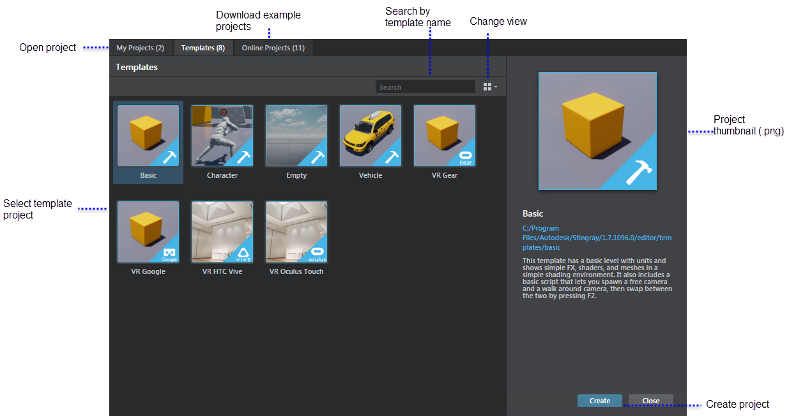

# Project Manager

The **Project Manager** launches automatically each time you start Stingray. You can also select **File > Project Manager** to open the **Project Manager**.

This window lets you create and manage your game projects and download online example projects.

Creating the project that organizes your entire game is the first task you'll complete in Stingray. Every project in Stingray is built from one of the template projects available in the **Project Manager**, or another existing project. This ensures you always have the correct project architecture necessary when Stingray compiles your game data.

---
Related topics:
-	~{ Set up a project }~
-	~{ About the project structure }~
-	~{ Template projects }~
-	~{ About engine configurations }~
- ~{ Download assets and example projects }~
---
