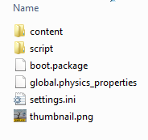
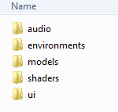

# About the project structure

This topic provides a basic explanation of how {{ProductName}} projects are organized.

## Project directories: source and compiled data

When you create a new project, the editor creates a folder with the same name as your project in the location you specify on disk. This top level <projectname> folder contains a set of project folders:  `<projectname>`,`<projectname>_data` and `<projectname>_wwise` .

Think of the `<projectname>` folder under the top level folder as the source folder for your project, containing all the files you'll work with to build your game: exported models, textures, scripts, and so on. All tools and editors read and write to this source directory.

The second folder, `<projectname>_data`, contains your source data compiled into optimized binary formats that are used at runtime on the game's target platforms. While you work in the interactive editor, and any time you run your game from the editor, the compiled data for Windows is automatically refreshed.

The editor creates a third folder, `<projectname>_wwise>`, which is set up for authoring audio content using Wwise. (See ~{ Working with audio }~  ).

The editor also creates a project file with a `stingray_project` extension, which contains project information including the current version of the resource data model, the default level the editor should load, Wwise project settings, and migration settings.

If you want to share your project with someone else, or if you want to check your project in to a version control system such as Git or SVN, you typically only need to worry about the source directory and the `_wwise` directory. Since the compiled data is always regenerated from the source directory, you don't need to redistribute it or check it into a source control system. See also ~{ Work with a version control system }~.

### Organizing your game content

The interactive engine does not place any requirements on the organization or structure of your project's resources. You can organize your game content into any kind of folder structure you want within your source directory. You are free to follow any convention for organizing your resources that works for your project.

For example, you might choose to organize your project by resource type: all of your textures in one folder, all of your animations in another folder, and all of your units in a third folder. Alternatively, you might choose to organize your source data by game object, so that everything related to a given character, vehicle or building is kept in the same folder -- unit, textures, animations, scripts and all. Or you might organize your data by level. The choice is up to you.

Later, you will bundle up your resources into packages: chunks of data that get stored, loaded and unloaded together. You can do this regardless of the layout of the resource files in your source folder. For more details, see ~{ Managing content and resources }~.

The only thing that is enforced is that the root of your project directory **must** contain a file called `settings.ini`, which provides some basic information that the game needs in order to start up. See below for details.

Note, however, that the editing tools and the asset importing process may use certain default locations within your project folder. For example, by default, Wwise audio resources are put into a `wwise` sub-folder. Similarly, Scaleform Studio projects are placed by default into an `s2d_projects` sub-folder.

### Default structure of the project source directory

When you start a new project based on a built-in template, you'll begin with two subdirectories created for you: *content* and *script*.

### Content directory

Inside the *content* directory, you'll see sub-folders for all the content used in the template, including art, textures, levels, and so on:

For more information on the kinds of files, or "resources", that {{ProductName}} uses, see ~{ About resources }~.

### Script directory

The *script* folder is a convenient place to save any custom scripts and Flow nodes that you write in order to create gameplay for your project:

For more on how you can use Lua scripts to create interactions between the player and your project content, see ~{ Scripting with Lua }~.

## Files in the project source directory

Each project source folder contains, at a minimum, the following files: `boot.package`, `global.physics_properties`, and `settings.ini`.

### boot.package

A resource file with the `.package` extension specifies a resource package: a chunk of related resources that will be stored, loaded and unloaded together in the final builds of the game.

When you start a new project based on a built-in template, your project is preset (in its `settings.ini` file) to load this `boot.package` file at startup. This package file determines which resources in the project get loaded into the engine when you run or deploy the project.

By default, this package includes all the resources that you see in the project. As you add more content to the project, you'll have to make sure that your new content is also covered by the boot package. See ~{ Defining resource packages }~ for details on how to add things to the package file.

Eventually you will probably want to divide your game content into multiple packages, which you load and unload on demand. For details, see ~{ Managing content and resources }~.

### global.physics_properties

This file provides global configuration settings for the physics sub-system. For details, see ~{ Global physics properties }~.

### settings.ini

This file provides a variety of user-editable settings that control the operation of the engine, such as rendering settings or startup packages. This file always needs to be kept in the root of the game project.

For details on all the settings that you can provide in this file, see the ~{ settings.ini file reference }~.
