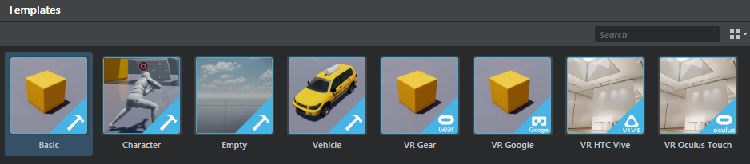

# Template projects

The {{ProductName}} editor ships with a few sample projects to help you get started. You can start a new project based on any of these templates in the ~{ Project Manager }~ when time you start the editor. Select the **Templates** tab in the **Project Manager** to see the templates you have installed.

>  You can find video walkthroughs of the templates <a href="http://area.autodesk.com/learning/series/introduction-to-stingray-template-projects" target="blank">here.</a>

The best way to start a new project is always to clone an existing one, like the Basic project, rather than starting completely from scratch. This ensures you have the correct project structure built in when it's time to compile your project.

If you want to start with nothing in your project, use the `Empty` project to start.

> **Tip:** To change the project thumbnail that displays for your project, replace the thumbnail.png image in the sample project folder. The default project thumbnails are 512 x 512 pixels.

## Basic

This template has a basic level with units and shows simple FX, shaders, and meshes in a simple shading environment.

It also includes a basic script that lets you spawn a free camera and a walk around camera, then swap between the two by pressing F2.

## Character

This template includes a basic shooter level with an animated 3D character. It's set up using Lua script. It has an animation controller, simple character animation examples, and the Lua script in player.lua that shows how they are all hooked up. The character shoots a simple physics-based projectile.

## Empty

This template defaults back to core/appkit and loads minimal level with a simple camera.

## Vehicle

This template is a simple vehicle level. It contains a driveable four-wheeled vehicle and the accompanying Lua script to set up the vehicle and the driving physics.

## VR Template projects

{{ProductName}} includes the following templates for rendering in VR devices. (See also: ~{ Get started in VR }~.)

<dl>
<dt>Desktop VR</dt>
<dd>This flexible VR template can be used with Oculus or HTC Vive systems. This template has a simple VR level with a floor plan to walk around in. It also includes a basic script that lets you spawn a free camera and a walk around camera.

The VR headset that is connected when you launch the template is used. If no headset is connected, then a regular player controller is used.

The **Desktop VR** template supports input from the Oculus Rift, Oculus Remote, Oculus Touch Controller, and Steam VR devices.

> **Tip:** If the performance is lower for the Desktop VR template projects, make sure that the editor is **not** set to **Update Mode > Always** in the viewport. It is recommended to use a higher end machine as this was tested on higher end graphics cards.</dd>

<dt>VR Google</dt>
<dd>This template demonstrates simple usage of the GoogleVR plug-in API for Cardboard and Daydream.

This template supports Google Cardboard for iOS and Android, and Google Daydream with Daydream controller support for Android devices.

Use iOS devices, Android 7.x+ devices like Nexus 9 or a Daydream device like Pixel with this template.

>Note: Google VR template won't run on *Normal* flavor or *localhost* (Windows).
</dd>

<dt>VR Gear</dt>
<dd>This template demonstrates simple usage of the GearVR plug-in API. See ~{ Build a project for Gear VR }~ for more information.</dd>

</dl>

> **Note:** The VR templates for mobile devices use the ~{ Mini renderer }~ by default. See ~{ Optimize VR content for mobile devices }~ for tips on preparing your VR scenes.

## Live Template

{{ProductName}} lets you download the Live Template project through the Online Projects tab in the ~{ Project Manager }~.
The **Live Template** offers all the Live functionality, but with a blank slate, so that you can bring in your own content and modify or extend its behavior. For more information, see the "Live Template" section under "Getting Started" ~{ Get started with the Live Template }~.

---
Related topics:
-	~{ About the project structure }~
-	~{ Project Manager }~
---
