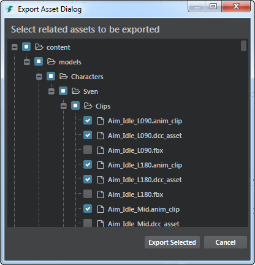
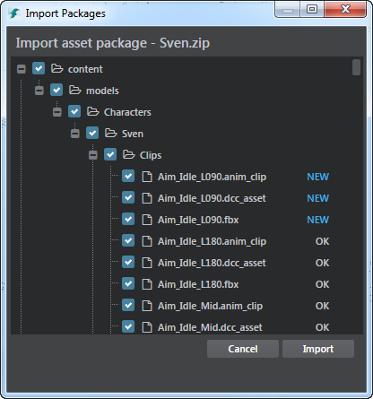

# Import and export assets as a package

You can package assets together and export them to a zip file, so they can easily be shared.

##Export assets as a package

1. In the **Asset Browser**, right-click the asset you want to export and select **Export Assets**.

2. In the **Export Asset Dialog** window that appears, select the assets and/or folders to export.

	

3. Click **Export Selected**.

4. In the window that appears, enter a filename and select a location for your exported files.

5. Click **Save**.
 
	The files are exported to a zip file and saved to the location you selected.

##Import packaged assets

1. From the main menus, select **File > Import**.

2. Navigate to the location of your zipped file, select it and click **Open**.

3. In the **Import Packages** window that appears, select or deselect assets. Deselected files are not imported into your scene.

	The status of each file is displayed next to the file name. **Ok** indicates no change, **New** indicates a new file, and **Modified** indicates a file has been updated.

	

4. Click **Import**.
 
	The assets are imported into your current project.

	>	**Note:** You can only import packages exported from Stingray.
