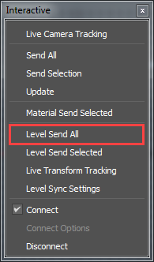

# Send assets from 3ds Max with Level Sync

Level sync workflows let you automatically rebuild your 3ds Max scenes in Stingray. Once 3ds Max is linked to the Stingray editor, scene assets can be automatically or manually tagged, and then quickly be reproduced with the same layout in Stingray. Modifications you make to the assets in 3ds Max are then updated inside Stingray. This makes it easier to build, iterate, review and change scenes, without having to manually reproduce layouts in two tools.

## Send selected assets from 3ds Max with level sync

1. Establish a live editing link between Stingray and your DCC tool. See ~{ Send assets to a DCC tool }~.
2. Tag the assets you want to send to Stingray. See ~{ Tag assets with Level Sync }~.
3. In 3ds Max, select **Stingray > Level Send Selected**.

  	
 
4. (Optional) In the **Send Level** window that appears, turn on **Send Missing Assets** to ensure assets that are missing from the project are included in the export.
5. Click **Send and Close**
 
  The selected asset(s) is sent to Stingray and opens in the current scene.

## Send all assets from 3ds Max with level sync
1. Establish a live editing link between Stingray and your DCC tool. See ~{ Send assets to a DCC tool }~.
2. In 3ds Max, select **Stingray > Level Send All**.

  	
 
  The assets are sent to Stingray and open in the current scene. A new folder, with the same name as your scene in 3ds Max, is created.

>**Note:** Level sync is supported in 3ds Max 2016 SP2 or higher.

---
Related topics:
- ~{ Tag assets with Level Sync }~
---
