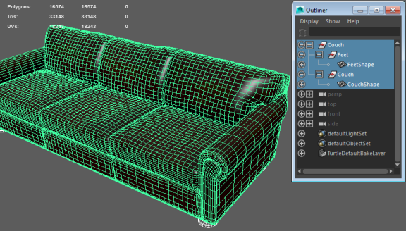
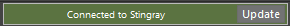

# Receive assets from Maya or Maya LT

With {{ProductName}} and Maya or Maya LT on the same system, you can import scenes directly to your {{ProductName}} project with no polygon count restriction.

**To import FBX assets to your {{ProductName}} project**

1.	Establish a connection with Maya LT. See ~{ Send assets to a DCC tool }~.

1.	With your model selected in Maya LT, select **File > Send to Stingray > All**.

	

1.	In the file browser that appears, navigate to where you want to save the FBX file within your interactive project, enter a new filename if needed, and click **Export All**.

1.	In the **Import FBX** options window that appears, set options to import your asset with textures and materials. See ~{ Import a model with textures and materials }~.

	Maya LT looks in your project for existing materials. If a matching material is found, it is assigned to the model on import.

1.	Click **Import**.

	Maya LT exports the scene to your interactive project, into the specified directory. The FBX file is available immediately in the **Asset Browser**, and you can place the imported assets into your level. Any materials associated with the imported objects are created as separate files alongside the asset in the project folder.

	

	A green "Connected to Stingray" message displays at the bottom right in Maya LT, and the Connect option (**Stingray > Connect**) is also enabled.

	

---
Related topics:
- ~{ Import a model with textures and materials }~
- ~{ Receive materials from Maya, Maya LT, or 3ds Max }~
- ~{ Interop with Maya, Maya LT, or 3ds Max }~
---
