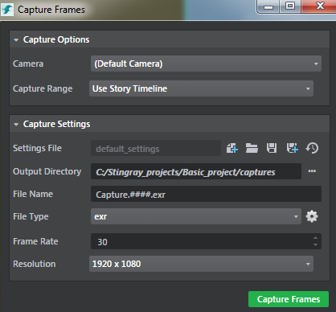

# Capture Frames Tool

The **Capture Frames** Tool lets you render frames to disk. The tool is integrated into the **Story Editor** workflow, and can also be initiated through Flow. For more information on using Flow, see the **Capture Frames** category in the [Flow Node Reference](../../flow_ref/index.html).

The following **Capture Settings** can be adjusted to control your output. See ~{ Capture frames to disk }~ for more information.

> **Note:** Click  in the **Story Editor** to open the **Capture Frames** window.

<dl>

## Capture Options
<dl>

<dt>Camera</dt>
<dd>Lets you select the camera to capture. </dd>

<dt>Capture Range</dt>
<dd>Lets you set a custom range for the camera to capture. Instead of recapturing your entire story after making a change to your animation, specify a **Capture Range**, and then quickly recapture only those details that need updating. You can select **Custom Range - Seconds** or **Custom Range - Frames**. To capture the entire story, select **Use Story Timeline**.

When setting a range, it is important to remember that your story starts at frame 0. The naming convention for the output EXR files is the same whether you are capturing in frames or seconds. For example, if you want to recapture from frame 3 to frame 8 of your story, File Name_3.exr to File Name_8.exr are output to the selected **Output Directory**, overwriting the existing files.

You can also capture negative frames, which use following naming convention; *<File Name>_-1.exr*, *<File Name>_-2.exr*, etc.; and are output as still frames.
</dd>

</dl>

## Capture settings
<dl>

<dt>Settings File</dt>
<dd>Lets you create a new settings file or open an existing file. To create a new capture settings file, click the  icon or right-click in the **Asset Browser** and select **Create > Capture Settings**.</dd>

<dt>Output Directory</dt>
<dd>The directory where your output is saved.</dd>

<dt>File Name</dt>
<dd>The name that is used for each file(s) that is saved.The file name contains #### frame padding to indicate the placement of frame numbers in the output files. You can have a file name with any number of # paddings. Note that there should be at least one number padding in the file name.

The # frame paddings could be in the beginning, middle and the end of the file name. For example, *###Filename.exr* would output frames *001Filename.exr*, *002Filename.exr*, ..,*010Filename.exr* and so on. If you have multiple # frame padding patterns, the capture engine always uses the last found ## pattern in a name to create the padding. For example *My###Filename-####Capture.exr* will output the frames as *My###Filename-0000Capture.exr*, *My###Filename-0001Capture.exr*, *My###Filename-0002Capture.exr* and the first left aligned pattern is ignored.
</dd>

<dt>File Type</dt>
<dd>Lets you select a file type for your output. Currently, frames are exported using the OpenEXR format (.exr). The tool delivers three different buffers in OpenEXR when it captures:

-   default: The output image in sRGB colorspace.
-   hdr_no_post: An HDR version in linear colorspace.
-   depth: A stabilized depth channel.</dd>

> **Note:** The rendered OpenEXR frames uses ZIP compression by default.

<dt>Frame Rate</dt>
<dd>The frame rate that is used to simulate the app or editor playback while capturing.</dd>

<dt>Resolution</dt>
<dd>Lets you set a resolution for your capture. Select 1920 x 1080 (default), 1280 x 780, or enter a custom resolution. The custom resolution you set here is available only when capturing from Story and not when capturing from Flow.</dd>

>**Note:** Compile the level or press F5 before capturing to take into account the level changes, especially if you add back to the Capture Frames tool a camera previously used for frame capturing and then deleted from the level.
