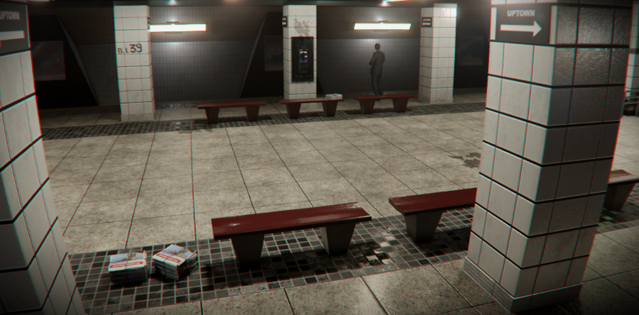
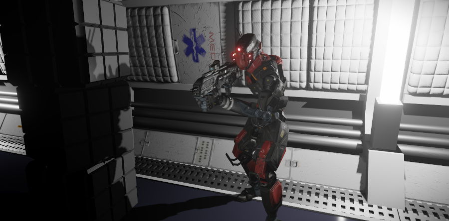
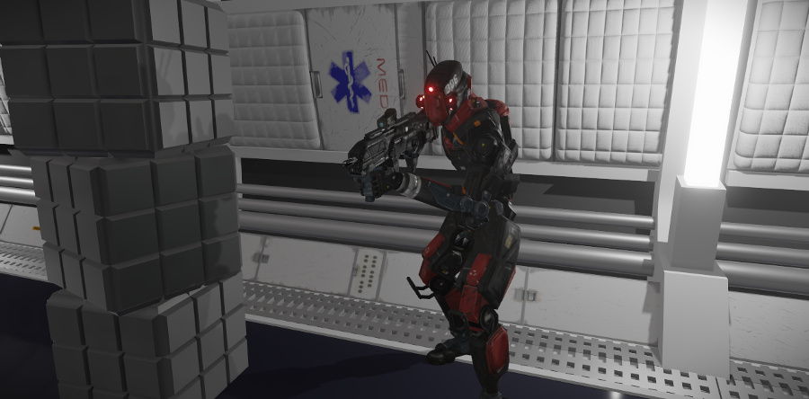
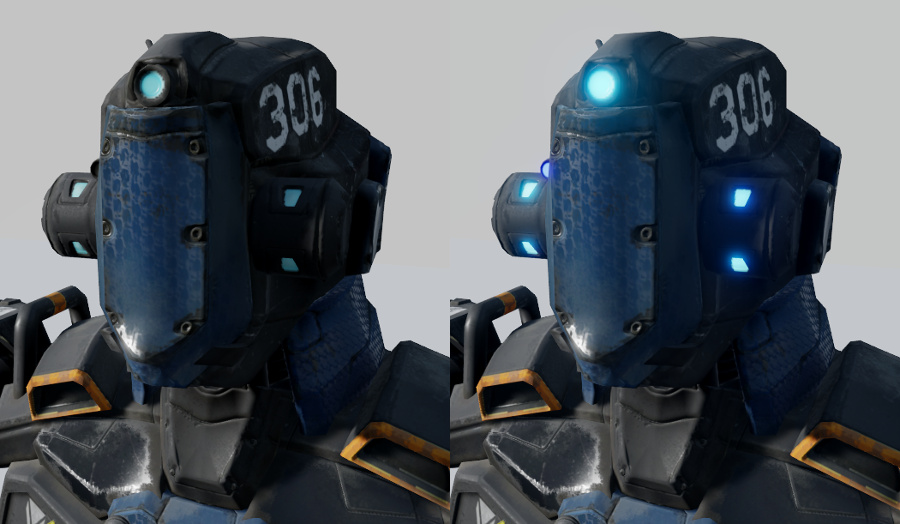

# Lighting

In the real world, you only see the things around you because light is constantly bouncing around, different wavelengths get absorbed and reflected, and some of the rays finally hit your eye. Similarly, in your game level, you won't see any of the objects you place in your scene without having some light to bounce from their surfaces and hit the camera.

Controlling the light in your game involves combining the contributions from many different sources that can interact in complex ways. When you set up the lighting for your level, you balance a number of factors:

-	Visual aesthetics: Lighting has a critical role in establishing and reinforcing the visual style, atmosphere and immersion of the scene.

-	Gameplay: Careful lighting design can be an effective way of focusing a player's attention, highlighting areas, and guiding a player through a level.

-	Performance: The way you set up your lighting and shadowing can have a large impact on performance and memory consumption in the game.

The topics in this section describe how to use all of the different lighting techniques that Stingray provides.

For example, the scene above uses direct lighting from several placed light sources overhead, ambient global light that is mostly visible in the shadowy areas, and an emissive material on the overhead units in order to make them appear to glow.

It's important to note that these lighting techniques are complementary to each other, and can be used in parallel in different parts of the game or different places within a level. For example, you might choose to *bake* high-quality lightmaps for rendering certain important static objects, but use a global lighting map for other less striking objects.

## Direct lighting

The game engine's rendering system sums up in real time all the *direct* illumination in the scene: all the light that bounces once off a surface and then straight to the camera. This direct illumination comes from light sources that you place in your level.

All levels are set up by default with a directional light that simulates a distant light source, typically the sun or moon. You can also create other kinds of light sources and place them in your level. Usually these light sources simulate the light emitted by objects in the scene like lamps, spotlights, candles, and torches. See ~{ Light sources }~.

Because direct lighting is calculated and rendered in real time during each frame of the game, it generates shadows that accurately reflect the placement and orientation of the objects and lights in your scene. For example, as this character moves around, it casts moving shadows on the ground and on nearby objects:

However, direct lighting on its own produces very sharp, very dark shadows. Anywhere that the rays from the placed lights do not reach ends up being rendered practically black. This gives a high-contrast, very dramatic effect. Level designers can balance this by placing more light sources in the level to fill in the dark areas, but a better approach is typically to add some *indirect* lighting to the scene. This indirect illumination fills in those shadowed areas so that their surfaces are still visible even when no direct light is hitting them.

## Indirect lighting

In the real world, light doesn't stop at one bounce. It reflects around from object to object until its energy is exhausted, getting around and behind objects. This creates *indirect* light that partially illuminates the shadowed areas, reducing the overall contrast.

The level of complexity involved in accurately simulating the spill of indirect light into shadowed areas is generally too much to simulate accurately in real time during the game. However, there are a couple of techniques you can use to simulate indirect light without expensive runtime calculations.

### Global lighting

You can set up your level's shading environment to add some *global lighting* to your scene: diffuse and specular light contributions that the real-time renderer applies equally to all surfaces in your level.

You typically set up this ambient light with textures baked by a reflection probe in order to make it seem like the ambient light is coming from the surrounding environment and/or the sky.

See ~{ Global environment lighting }~.

### Baked lighting

If you need to achieve more accurate and realistic indirect lighting without increasing the burden on the hardware running the game, you can also try to *bake* your scene's lighting. This creates a set of texture files on disk, called "lightmaps", that contain the illumination that reaches each surface in your level.

Calculating these lightmaps takes extra time, and loading the lightmaps into the game takes extra memory, but the runtime CPU performance and the realism are usually better than fully dynamic lighting.

See ~{ Light baking }~.

## Physically based lighting

The measurement of light is known as photometry. You can use photometric lights to more accurately define lights in your scene. In Stingray, the Physical Light Entity lets you use data from real-world lights to create a realistic distribution of light in your scene.

See ~{ Physically Based Lighting }~.

## Emissive glow

You can use the *emissive* property of your Stingray materials to make parts of your models appear to glow, like a car's taillights, LEDs on a machine, or a neon sign. You set up these emissive contributions in the materials that you use to shade the objects.

Emissive materials do not actually emit direct light onto other objects in your scene. The real-time renderer does not include any direct contributions from them. But, combined with a little bloom applied by the shading environment in post-processing, this makes an effective, low-cost way to simulate small light sources.

If you need an emissive object to shed direct light on the surrounding scene, you can pair it with a dynamic light source such as a spotlight, or bake it -- contributions from emissive materials *do* get included when baking indirect light.

See also the topics in the ~{ Shading }~ section. <!-- TODO: link to PBS overview -->

---
Related topics:
-	~{ The Shading environment and post effects }~

---
