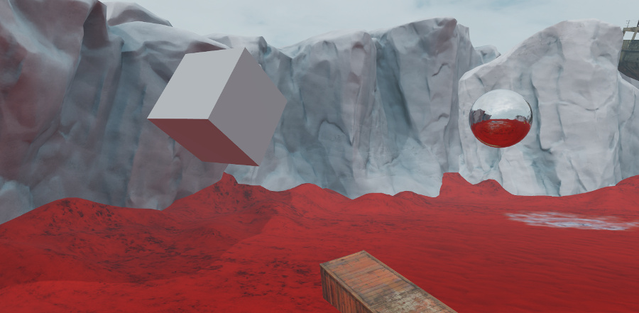

# Global environment lighting

In most levels, you will want the scene to include some level of ambient diffuse light that applies to all objects. This ensures that all the objects in the level can be seen, even those that do not receive direct light from the main directional light (i.e. the sun light) or from any placed dynamic light sources. This is a very low-cost way of simulating indirect light contributions that are too expensive to calculate at runtime, without the memory and time costs involved in baking indirect light.

You will typically want to base this global lighting for your level on the surrounding environment. This makes the objects appear more realistically shaded as a part of the scene.

To do this, you place a reflection probe in your level, bake its point of view on the scene into textures, and set up the shading environment to use those textures for global lighting.

For example, in the image below, the reflection probe (the sphere on the right) is placed so that it picks up the red ground and the white/blue sky. Once the reflection probe is baked and set up in the shading environment, all the objects in the scene, like the floating cube on the right, pick up some of the red color on their undersides and the white/blue color on their upper faces:

**To set up global diffuse and specular lighting:**

1.	Enter the reflection probe placement mode by doing either of the following:

	-	Open the ~{ Create panel }~ to the **Helpers** tab. Under the **Rendering** group, select **Reflection probe**.

	-	From the main menu, select **Create > Reflection Probe Entity**.

1.	Click the viewport to place a new reflection probe into your level. Your probe is represented by a shiny sphere, giving you an idea of what objects it will pick up when you bake its reflections. Switch to the Move tool and adjust the probe's placement if needed.

	Remember that whatever the probe can see from its point of view will get baked into its textures. Put the probe in a location that best represents the overall environment that you want to contribute to your level's lighting.

	For global lighting, you don't have to worry about configuring other properties for the probe like its volumes and falloff, the way you would for probes that provide localized reflections at specific places in your level (see ~{ Set up a baked reflection probe }~).

1.	Save your level.

1.	Bake your probe. From the main menu, select **Window > Lighting > Bake Reflection Probes**.

	Stingray creates a new subfolder in the same folder as the current level's *.level* resource file, named `<level_name>-cubemaps`. In this folder, it stores *.dds* and *.texture* files for the diffuse and specular light from each reflection probe in the level. You'll need to refer to these texture resources later.

1.	In the ~{ Explorer panel }~, find and select your shading environment entity.

1.	In the ~{ Property Editor }~, find the **Global Lighting** category.

1.	Set up global diffuse lighting:

	-	Set the **Global Diffuse Map** to point to the `<probe_name>_diffuse_bake` texture baked for your probe in the `<level_name>-cubemaps` folder.

	-	Use the settings next to **Baked Diffuse Tint** to control the color and intensity of the diffuse light from the probe.

1.	Set up global specular lighting:

	-	Set the **Global Specular Map** to point to the `<probe_name>_specular_bake` texture baked for your probe in the `<level_name>-cubemaps` folder.

	-	Use the settings next to **Reflections Tint** to control the color and intensity of the specular reflections in your level.

1.	Set up global radiance (currently used only by the Stingray light baker):

	-	Set the **Global Radiance Map** to point to the `<probe_name>_radiance_bake` texture baked for your probe in the `<level_name>-cubemaps` folder.

If you make any drastic changes to the overall lighting environment in your level, such as changing the skydome image or modifying bright dynamic lights, you will likely also want to re-bake your global reflection probe to pick up the changes to the environment.

> **Note:** Each time you bake, any previously baked textures are deleted, and new ones are created based on the current names of the reflection probes. This means that if you rename a reflection probe, you'll need to update the references in your shading environment.

---
Related topics:
-	~{ Shading environment properties }~
-	~{ Change shading environment properties }~
-	~{ Light baking }~
-	~{ Reflections }~

---
