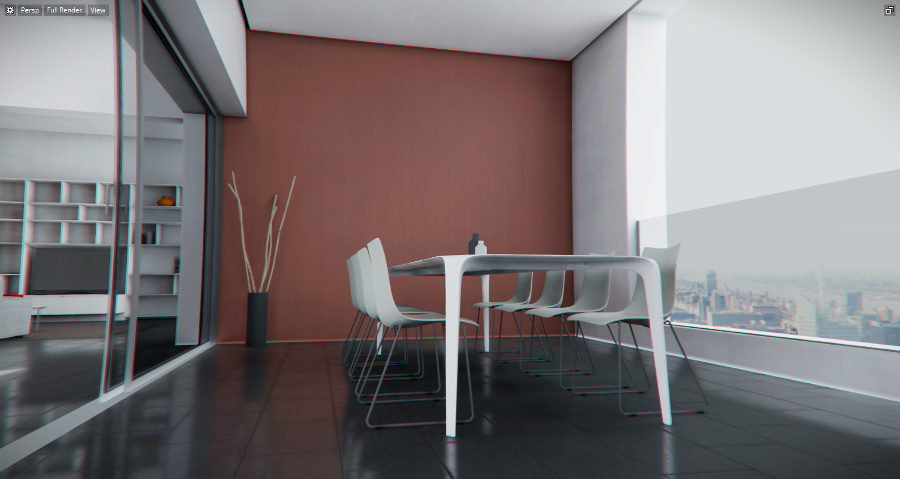

# Light baking

*Light baking* is the process of pre-calculating the lighting for the objects in your level and saving it to textures on disk. These textures are called *lightmaps*. At runtime, the engine loads the lightmaps and applies their pre-calculated illumination back to the objects in the level, instead of having to calculate the lighting in real time every frame of the engine's main loop.

## Why bake lighting?

There are a few very good reasons why you would want to bake the lighting for your scene, outlined below.

### Realism and quality

Although every year brings new real-time rendering algorithms and more powerful GPUs, real-time rendering still cannot produce the subtle lighting effects available by pre-calculating the light. For example, the lighting effects that you can introduce into your levels by baking their lighting include:

-	color bouncing, where light that bounces off a colored surface bleeds its color to the indirect lighting on adjacent surfaces.
-	more realistic shadows, with softer edges and natural falloff within the indirect light.
-	colored shadows from light shining through colored transparent surfaces.
-	light from emissive surfaces illuminating other objects in the scene.

### Performance

By pre-calculating some or all of the light that hits the objects in your scene, you reduce the amount of work that the engine has to do in every frame. Instead of dynamically processing the light in the scene, all the engine has to do is apply an extra texture to each object, which is relatively cheap in processing power. This frees up cycles on the device's GPU and CPU to do other things.

### Predictable results across platforms

When you develop an interactive app for multiple different kinds of devices, you are dependent on different GPUs that have different features, abilities and resources. Because of this, different devices may produce results that *look* different; or, a real-time lighting setup that works fine on one device may overtax the resources on a different device.

When you pre-compute your lighting, you get to use the best possible result on all platforms, with a predictable level of performance.

## Why not bake lighting?

With all the benefits listed above, why not always bake lighting all the time? There are some tradeoffs outlined below. Depending on the needs of your project, you may decide that these tradeoffs are acceptable or not.

### Memory usage

Textures take up a lot of memory at runtime. Baking lightmaps adds more textures that you need to load into the engine, and therefore adds significantly to the engine's memory footprint.

You may be able to work around this issue by reducing the memory size of your lightmaps selectively for different platforms. You can compress the textures, and discard their largest mip map steps. For more information, see ~{ Optimize memory usage }~ and ~{ Working with textures }~.

### Workflow

Pre-calculating realistic global illumination takes time. To get very high-quality results on big scenes, it can take a very large amount of time -- sometimes many hours or even days each time you do a final bake. You have to factor this extra time into your level design and production workflow.

The built-in GPU-accelerated light baker converges toward its final result by iterating through multiple passes, increasing the quality of the rendering each time. This lets you get preliminary results quickly, so you can reduce the number of times you need to bake. See ~{ Bake lightmaps }~.

### Static objects and lights only

Because lightmaps are pre-computed, they are only effective for static lights shining on static objects. However, projects often have dynamic elements that move around in the scene.

Say that you bake the lighting for a scene in which you have a lamp set up to shine down on a desk that holds some books and papers. The lightmap textures for the objects will be brightly lit, and the lightmap texture for the desk will show a bright pool of light from the lamp, with shadows from the books and papers. If that lamp moves in the scene, the desk and the objects will still show that same pool of light in the same location as if the lamp were still in place. Conversely, if the books and papers move, they will still appear lit by the light, and the places where they had been on the desk will be shadowed.

A typical way to deal with this is to bake only indirect light, and only for objects and lights that are relatively static. Direct lighting for all objects is often done in real time. That way, moving objects continue to receive dynamic shadows and use the indirect lighting from the baked global lighting, but stationary objects get their indirect lighting from the higher-quality lightmaps.
