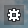

# Baking with the built-in light baker

This page details the way the built-in light baker works by default, and how you can configure it using the settings in the **Bake Lightmaps** window.

## What does it bake?

For each surface, the built-in baker includes in the lightmap:

-	All *indirect* illumination, which hits the baked surface after bouncing off of one or more other surfaces in the scene. This also includes light coming from emissive textures, and environmental light contributed by the sky texture.

-	*Direct* illumination and shadows only from lights that have their **Baking** property set to "Direct & Indirect".

## How does it bake?

The built-in baker does multiple passes over the scene, each time progressively refining the result to converge toward a high-quality final solution. This means that you can quickly get a basic idea of what the final result will look like. You can also quit baking when the result stops improving.

Each pass makes use of your computer's GPU to accelerate the rendering. It only proceeds when the editor is actively using the GPU. Therefore, you will likely want to set your viewport to update all the time, instead of updating only when the editor is focused. That way, your baking session will continue processing even if you click away from the interactive editor or leave your computer.

-	In the viewport, click the options icon  in the overlay, and select **Update Mode > Always** from the contextual menu.

## Bake settings

You can use the settings in the **Bake Lightmaps** window to control the way the baker produces its lightmaps.

<dl>

<dt>Lightmap resolution (Texel/Meter)</dt>
<dd>Controls the global resolution of the lightmaps produced by the baker in texels per meter.

The baker will make sure that all surfaces keep the assigned lightmap resolution. Use the resolution multiplier found in the per mesh settings to allow for higher resolution on certain objects in your scene.

Increasing this number will permit the baker to put more detail into each lightmap, which allows room for higher quality, more precise results. However, increasing this value can actually produce noisier results if there are not enough sample passes to achieve that level of detail. Increasing this value also increases the size in memory of each lightmap, and makes each sample pass take longer.</dd>

<dt>Total sample passes</dt>
<dd>Sets the maximum number of passes the light baker will make.

Increasing this value may improve the quality of the final results, if the number of passes is not high enough to converge on a high-quality result. However, it also makes the full baking session take longer to complete.</dd>

<dt>Radiance map intensity</dt>
<dd>Determines how much the radiance map texture contributes to the baked lighting.</dd>

<dt>Indirect intensity</dt>
<dd>Increases or decreases the strength of the indirect illumination the baker applies to the surfaces in your level.</dd>

<dt>Emissive intensity</dt>
<dd>Increases or decreases the amount of diffuse light cast out into the scene from surfaces whose materials have emissive color and emissive intensity.</dd>

<dt>Diffuse boost</dt>
<dd>Increases or decreases the amount of diffuse light the baker applies to baked surfaces.

Raising this value causes darker surfaces to become brighter and to bounce more light back out into the scene. This may help you get better results if the materials in your scene are too dark to scatter light effectively.

Note that you may need to set this value very high in order to see the effect.</dd>

<dt>Filter Lightmaps</dt>
<dd>Applies a filter to reduce the light noise.</dd>

<dt>Use Compute</dt>
<dd>When enabled (default), the baker uses compute shaders, optimizing the performance of the baker on most scenes and hardware.

>**Tip:** Disable **Use Compute** if you are running slower hardware.</dd>

<dt>Interactive</dt>
<dd>Disable **Interactive** baking to better control your memory consumption while baking. Instead of baking everything in the scene and showing the progress, non-interactive baking bakes one object in the scene completely and then outputs the lightmap, saving memory in the process. Both modes produce the same lightmaps.

>**Note:** Non-interactive baking is the default baking mode when you launch a baking session from the command line. See ~{ Trigger lightmap baking from the command line }~.
<dd>

</dl>

See also ~{ Lightmap baking settings }~.

## While baking

-	The progress bar in the ~{ Status bar }~ shows the overall progress of the bake, along with the number of the render pass that the baker is currently working on.
-	Click **Cancel** to abandon the current baking session, without saving the progress to date.
-	Click **Pause** to temporarily interrupt the current baking session without discarding the progress to date.
-	Click **Resume** to continue a paused session.
-	Click **Save** to stop the current baking session, saving the lightmaps that have been generated so far.
