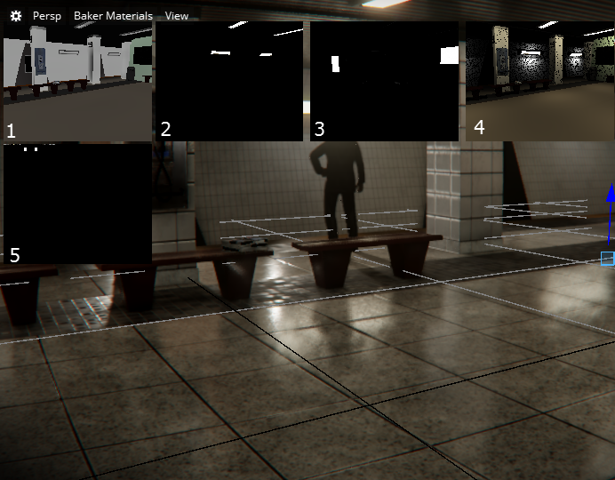

# Light Baker Visualization mode

Light baking is the process of pre-calculating the lighting for the objects in your level and saving it to textures on disk. These textures are called lightmaps. Visualization modes let you view and debug your lightmaps during the baking process.

**Baker Materials** mode can be enabled by clicking the **Full Render** mode HUD in the **Level Viewport**, selecting **Debug** in the menu that appears, and then selecting **Baker Materials**. See ~{ Level Viewport }~.

## Baker Materials

The light baker transfers materials by saving them as low resolution textures. In **Baker Materials** visualization mode, you can see the scene as the light baker sees it.

To activate this mode, you must initiate a baking session. For more information, see ~{ Bake lightmaps }~.

>**Important:** To view Baker Materials mode, you must select the viewport before initiating a baking session.

When your baking session is active, **Baker Materials** mode displays five smaller viewports, showing the following:

<ol>

<li>**Diffuse**: Displays material color.</li>

<li>**Emissive**: Displays materials that glow.</li>

<li>**Transparency**: When surfaces are opaque, they appear black in the viewport. Surfaces that let through blue light appear blue. </li>

<li>**Raytraced**: Shows the scene with direct light sources only and no global illumination.</li>

<li>**Material-atlas**: All of the small material textures are combined into one big texture, showing how much space the current scene is using.</li>
</ol>
