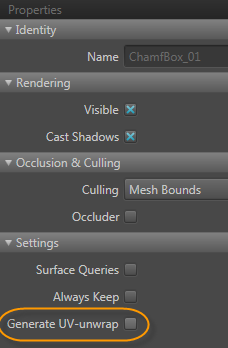

# Unwrap UVs for light baking

In order to store baked lighting for objects, {{ProductName}} needs to unfold each mesh using a *UV set*: a mapping of each vertex in the three-dimensional mesh into two-dimensional texture space. Since the first UV set assigned to a mesh (usually named *uv0* in Maya, for example) is usually used for textures like color maps and normal maps, the built-in {{ProductName}} light baker bakes lightmaps using a second UV set (e.g. *uv1* in Maya).

It's best to create UV sets using 3D design tools like Maya or 3ds Max, and save them in the *.fbx* file that you use to import the asset into {{ProductName}}. These design apps give you tools to optimize the way the 3D mesh is represented in 2D space:

-	The amount of space each face of your model has in UV space determines the resolution or detail that your baked lightmap can achieve. Therefore, it's best to set up your UV sets so that the most important parts of the model get the most area in texture space.

-	Unfolding and flattening a convex mesh into 2D usually involves introducing some "seams": places where an edge of the model has to be split. At these places, the seams can sometimes be visible when the lightmap is applied back to the object in the scene. Therefore, it's best to make the seams occur where they are least noticeable.

You can automatically generate a UV set for light baking as you import an FBX file. The **Generate UVs for Light Baking** is on by default in the **Import FBX** options. See ~{ Import an FBX file }~.

If you have a unit that doesn't yet have UVs for a mesh, you can have {{ProductName}} auto-generate a UV set for you in the **Unit Editor**. This lets you bake lighting for any mesh, even if its UV set has not been optimized.

**To generate UVs automatically on import:**

1.	Ensure that the second UV set on your object is empty.

2.	When importing the *.fbx* file for your unit, make sure to check the **Generate UVs for Light Baking** check box in the **Import FBX** window.

**To generate UVs automatically for an already imported unit:**

1.	Ensure that the second UV set on your object is empty.

1.	In the ~{ Asset Browser }~, double-click the unit to open the ~{ Unit Editor }~.

1.	In the **Unit Editor**, select the mesh you want to unwrap in the tree view on the left.

1.	In the **Properties** panel, check the **Generate UV-unwrap** option.

	

1. Save the unit.

## General lightmapping tips:

For best results when baking lightmaps, you'll want to learn a bit about what a good unwrapped layout for UVs looks like. Here are some general tips:

-	All faces should be nicely laid out and use up as much UV space as possible.

-	Big faces (like the floor and walls) get more space than a small face. The more space they have in the lightmap, the more resolution they have for light and shadow.

-	Place seams where they are not overly visible.

-	Avoid long, thin faces that have almost no UV space.

-	Avoid overlapping faces.

See the documentation for your modeling tool, like [Maya](http://www.autodesk.com/maya-docs), [Maya LT](http://www.autodesk.com/mayalt-docs) or [3ds Max](http://www.autodesk.com/3dsmax-docs)

## View UV unwrapping in the Level Viewport

Poor UV unwrapping can cause artifacts when rendering your objects with their baked lightmaps. After you bake your lighting at least once, you can inspect the quality of unwrapping in the **Level Viewport**.

-	From the viewport overlay, click **Full Render > Lighting > Lightmap Texels**.

The **Level Viewport** switches to Lightmap Texels viewing mode, which displays a checker pattern on all objects to show you the UV unwrapping.

Inspect the checker pattern carefully to look for distortions that indicate seams, overlap, or other UV issues.
