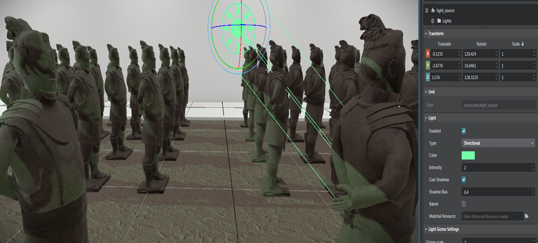
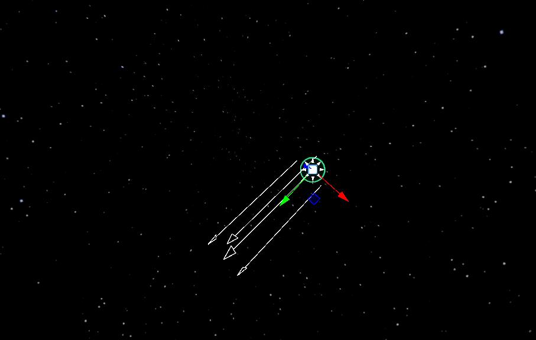
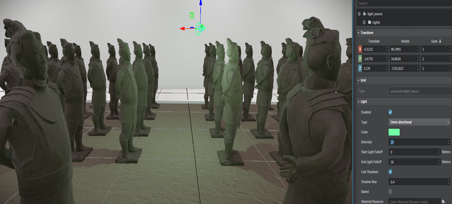
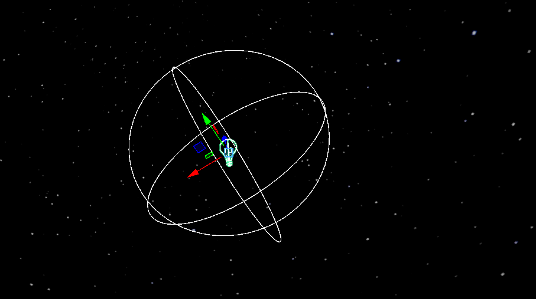
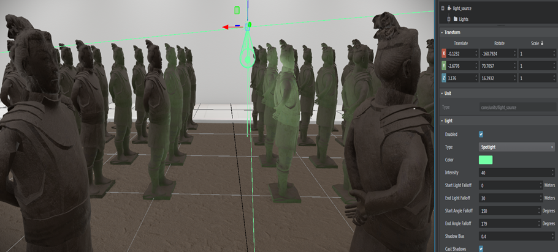
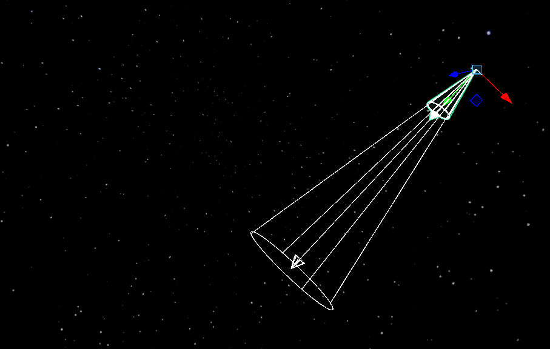
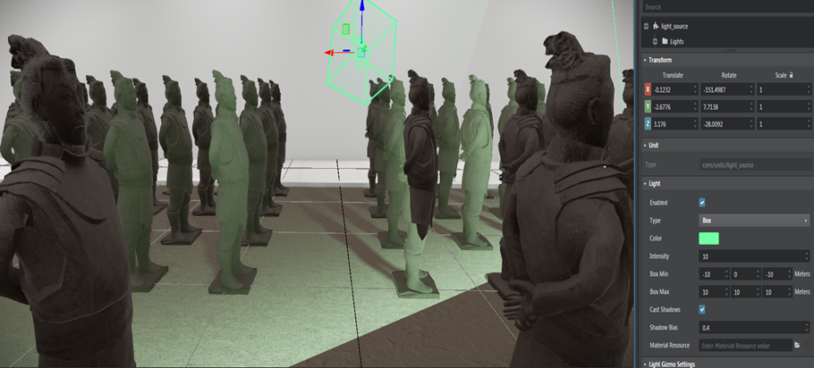
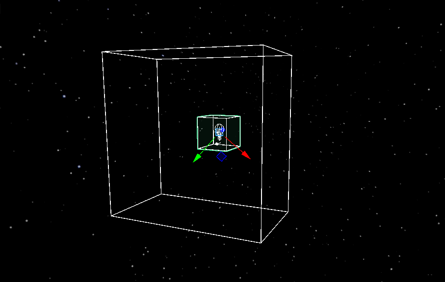

# Light sources

Your level needs some light sources to provide illumination for the other objects, scenery and characters in the scene. Without any light sources, a level is lit only the ambient global lighting provided by the shading environment, which provides a flat, dull, even illumination. By placing light sources in your scene, you can make your level much more realistic, dynamic, and attractive.

The direct light and shadows from the light sources you place in your level are calculated in real-time, unless you specifically reserve the light only for baking.

## Types of placed light sources

You can create different kinds of light sources that emit light in different ways, and within different kinds of volumes. {{ProductName}} offers four types of dynamic light sources: directional, omni-directional, spotlights, and box lights.

### Directional lights

Directional lights simulate the light coming from distant sources such as the sun or the moon. The source is assumed to be so far away that its rays travel in parallel in a single direction, rather than radiating from the position of the source. Note the way the shadows from the statues are parallel to each other:

In the editor, a directional light is shown by white arrows pointing in the direction of the light:

By rotating the light source, you can make the light hit the scene from a different angle.

Note that since a directional light source shines with equal intensity over the whole level, its position in the scene does not matter. Also, it does not attenuate over distance.

Every new level you create comes with a default directional light that represents the sun. You can edit the settings of this light freely, or delete it if you are making an indoor level that doesn't need a far-off light in the sky.

### Omni-directional lights

Omni-directional lights shine their light outward in all directions from their position in the 3D scene. The light fades out with the distance from the position of the light source.

Note that, in contrast to the directional light image above, the shadows from the statues are not parallel, since the light radiates outward from a single point.

In the editor, an omni-directional light is shown by a white sphere around the light source:

You can move the light source to a new position in the scene, and you can set how far its light reaches. Note that since an omni-directional light shines equally in all directions, its orientation does not matter.

### Spot lights

Spot lights, like omni-directional lights, shine their light outward from their position in the 3D scene. However, their light is only emitted within a defined cone around the positive direction of the local front (Y) axis of the light source.

The light fades out with distance from the position of the light source. It also fades out with distance from the local Y axis of the light source, making the spot brighter in the center than at the edges.

In the editor, a spot light is shown by a white arrow along the direction the light is shining, and a white cone that marks the outer boundary of the spot:

### Box lights

Box lights project illumination within a three-dimensional bounding box. The light radiates in parallel rays from one entire inner face of the box, in the positive direction of the local front (Y) axis. The light fades with distance until it falls off to zero at the opposite face of the box.

Note the sharp shadows where the edges of the box intersect the objects in the level:

In the editor, a box light is shown by a white 3D bounding box. The white arrow in the move gizmo shows the direction the light shines:

Box lights can be useful for simulating directional light that comes into a scene through a rectangular opening like a window or door.

>**Note:** Box lights are not supported on platforms like Android and iOS.
