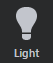
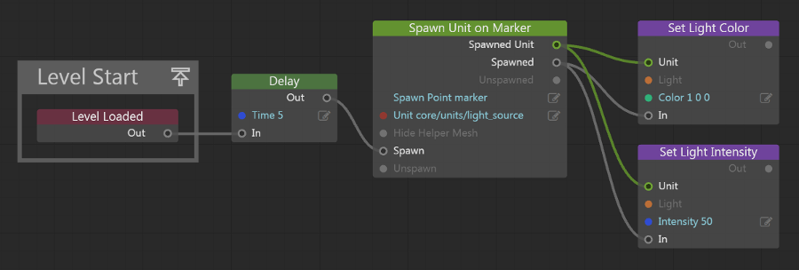

# Create a light source

Light sources are contained within units. Each unit can contain zero, one, or many light sources.

You create light sources in your game by placing or spawning any type of unit that contains one or more light sources. For example, the core resources contains a helper unit, `core/unit/light_source.unit`, that contains a single light source. This helper unit is represented in the interactive editor viewport as a light bulb:

The instructions below describe how to place and spawn an instance of this helper unit in the interactive editor, in Lua, and in Flow.

## Level editing

To create a new light source in a level:

1.	Open the ~{ Create panel }~.

2.	Click the **Lights** tab, and select the **Light** icon to activate the **Place** tool.

	

3.	Click a location in your level to place a new light source. While the **Place** tool is active, you can add as many lights as you need.

4.	When you are done, click the **Light** icon again, or switch to a different viewport interaction tool.

## Lua and Flow

To create a new light source on the fly, spawn an instance of the `core/units/light_source.unit` helper unit. Use the same commands you would normally use to spawn an instance of any other kind of unit:

-	**Lua:** Use the `stingray.World.spawn_unit()` function.

-	**Flow:** Use either of the **Unit > Spawn Unit on Marker** or **Unit > Spawn Unit on Position** nodes.

The new unit is automatically set up with a light source. You can then set up its properties using other Flow nodes in the **Light** category, or using the `stingray.Light` object in Lua.

For example, the following chain creates a bright red light at a preset location after a short delay:

## Importing lights

As an alternative to creating light sources directly in your level in the interactive editor, you can create lights in your 3D content creation tool, save them in the *.fbx* file along with your model, and import the model into a new unit. You might find this easier to manage if you have an object that you want to always cast light in a certain way from a certain position, like a lamppost.

The kinds of lights and light source features supported by {{ProductName}} may not match the lights and features supported by your content creation tool. The FBX importer will do its best to translate the properties of the light from your 3D design tool, but you may need to tweak the properties of the light after importing. To do this, double-click your new unit to open it in the Unit Editor, find the light or lights you want to modify in the unit's scene hierarchy, and use the controls in the Properties panel to change the light settings.

Note that changing the light properties in the Unit Editor will change the properties for all instances of that unit. You can also override these default settings within each instance of the unit that you spawn.

---
Related topics:
-	~{ Change light source properties }~

---
