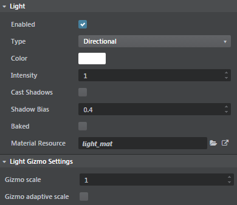

# Light source properties

This page details the properties you can set for placeable light sources.

## Common properties

<dl>
<dt>Enabled</dt>
<dd>Determines whether or not the light emits light into the scene. Use this switch to toggle the light on and off.</dd>
<dt>Type</dt>
<dd>Determines the type of light source this object is: how it emits light, or what kind of volume bounds the light that it emits. Depending on what you select here, you may have different settings for the light's extents. See the sections below.</dd>
<dt>Color</dt>
<dd>Sets the color of the light emitted by this source.</dd>
<dt>Intensity</dt>
<dd>Sets the maximum brightness of the light.</dd>
<dt>Cast Shadows</dt>
<dd>Determines whether or not this source casts shadows when the light it emits is blocked by an object in the scene.</dd>
<dt>Shadow Bias</dt>
<dd>For shadow-casting lights, this setting offsets the light's shadow map when projecting the shadows onto the objects in the scene. This can help to avoid artifacts. See also ~{ Shadows }~.</dd>
<dt>Baked</dt>
<dd>When checked, this light source will *only* emit light during baking. The real-time renderer will not apply any contributions from this light. Enable this setting if you want to bake the direct light and shadow from this source as well as its indirect light.</dd>
<dt>Material Resource</dt>
<dd>Sets the material used to calculate the light emitted by this source. See also ~{ Create a custom light material }~.</dd>
</dl>

## Light Gizmo settings

<dl>
<dt>Gizmo scale</dt>
<dd>Scales the gizmo to adjust the size of the light icon.</dd>
<dt>Gizmo adaptive scale</dt>
<dd>When enabled, this scales the light gizmo based on the camera distance, making it easy to view the light icon on zoom level changes.</dd>
</dl>

## Omni-directional lights

<dl>
<dt>Start Light Falloff</dt>
<dd>The distance from the light source's position at which the light begins to attenuate. Anything closer to the light source than this distance is lit with the light's full intensity.</dd>
<dt>End Light Falloff</dt>
<dd>The distance from the light source's position at which the light has attenuated to zero. Nothing farther away than this distance will be affected by the light from this source.</dd>
</dl>

## Spot lights

<dl>
<dt>Start Light Falloff</dt>
<dd>The distance from the light source's position at which the light begins to attenuate. Anything closer to the light source than this distance is lit with the light's full intensity.</dd>
<dt>End Light Falloff</dt>
<dd>The distance from the light source's position at which the light has attenuated to zero. Nothing farther away than this distance will be affected by the light from this source.</dd>
<dt>Start Angle Falloff</dt>
<dd>The distance from the spot light's projection axis at which the light begins to attenuate. Anything closer to the center of the spot than this distance is lit with the light's full intensity.</dd>
<dt>End Angle Falloff</dt>
<dd>The distance from the spot light's projection axis at which the light has attenuated to zero. Nothing farther away than this distance will be affected by the light from this source.</dd>
</dl>

## Box lights

Box lights have a three-dimensional bounding box that is defined by two diagonally opposite corners called the *minima* and *maxima*. The *minima* is the corner with the lowest distance values from the light source position on all three local axes, and the *maxima* is the corner with the largest distance values.

The value of each axis in the **Box Min** control should be lower than the same axis in the **Box Max** control.

<dl>
<dt>Box Min</dt>
<dd>The distance from the position of the light source to the *minima* of the box, on all three (X, Y, Z) axes of the light's local space.</dd>
<dt>Box Max</dt>
<dd>The distance from the position of the light source to the *maxima* of the box, on all three (X, Y, Z) axes of the light's local space.</dd>
</dl>
