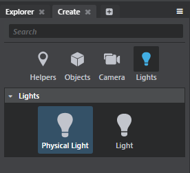
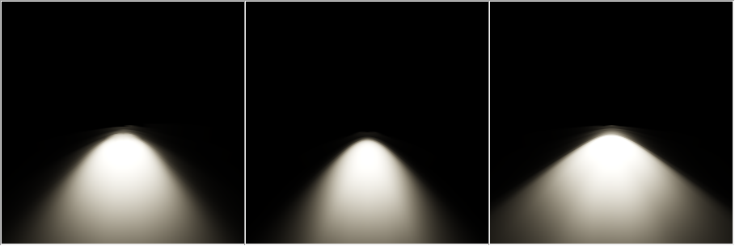

# Physically Based Lighting

The measurement of light is known as photometry. You can use photometric lights to more accurately define lights in your scene. In Stingray, the Physical Light Entity lets you use data from real-world lights to create a realistic distribution of light in your scene.

Physical lights can be added to your scene from the **Create** panel.

## IES Light Profiles

IES Light Profiles are digital profiles of real-world lights. These ASCII data files describe how a light is cast. When assigned to a **Physical Light** in Stingray, IES profiles help create life-like lighting.

You can download IES Light Profiles from manufacturers like [Phillips](http://www.usa.lighting.philips.com/support/support/literature/photometric-data) and [Lithonia](http://lithonia.com/photometrics.aspx). [Renderman](https://renderman.pixar.com/view/DP25764) also has an IES light collection.

## Viewing IES Light Profiles

You can download the [IES Viewer](http://www.photometricviewer.com/?i=1) to view the photometric curve and a rendering of the light distribution for individual IES Light Profiles.

The following renders show IES profiles for lights from the Lithonia LDN4 Square Series, the LDN6 Round Series, and the LF6N Open series.

