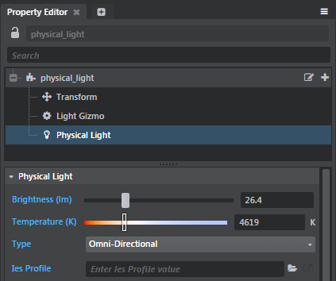
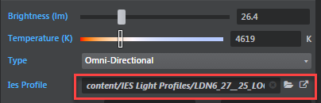

# Create a physical light

The **Physical Light** entity lets you use data from real-world lights to create a realistic distribution of light in your scene.

## To create a physical light

1. In the **Create** panel, select the **Physical Light** and drag-and-drop it into your scene.

	

2. Select the **Physical Light** in the **Property Editor**.

	

3. Adjust the following properties:
  	- **Brightness**: Drag the slider to adjust the intensity of the light, measured in lumens.
  	- **Temperature (K)**: Drag the slider to adjust the color of the light. Decrease the temperature to produce a warmer light, and increase the temperature to produce a cooler light.

4. (Optional) Import an IES Light profile. See ~{ Getting Started: Import assets }~ for more details.

	>**Tip:** You can download IES Light Profiles from manufacturers like [Phillips](http://www.usa.lighting.philips.com/support/support/literature/photometric-data) and [Lithonia](http://lithonia.com/photometrics.aspx).

5. Do the following to assign your imported IES profile to your **Physical Light**:
  	- Select the physical light in your scene.
  	- In the **Asset Browser**, select the IES Light profile
  	- Drag and drop the profile onto the **IES profile** field in the **Property Editor**.

  		

  	The distibution of the selected light in the scene adjusts to match the data contained in the IES Light profile.
