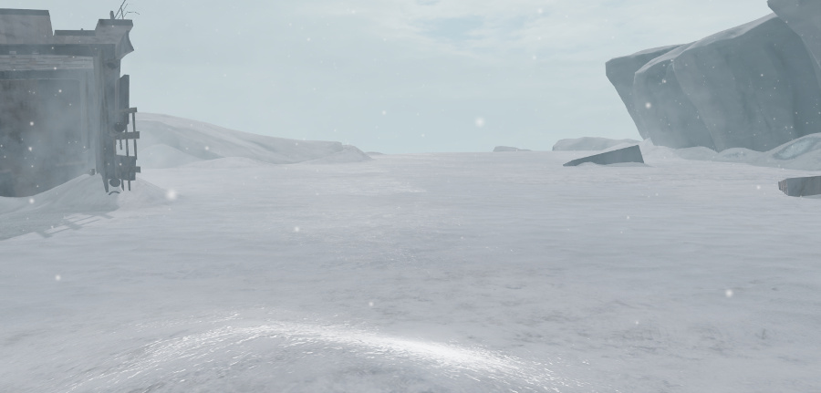
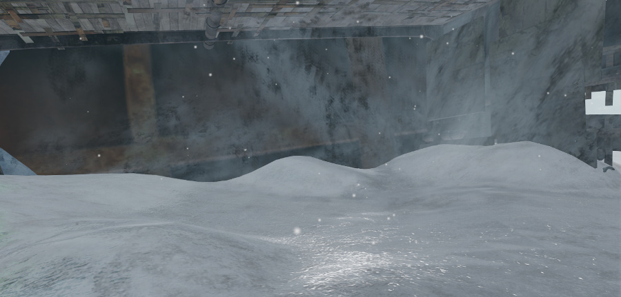
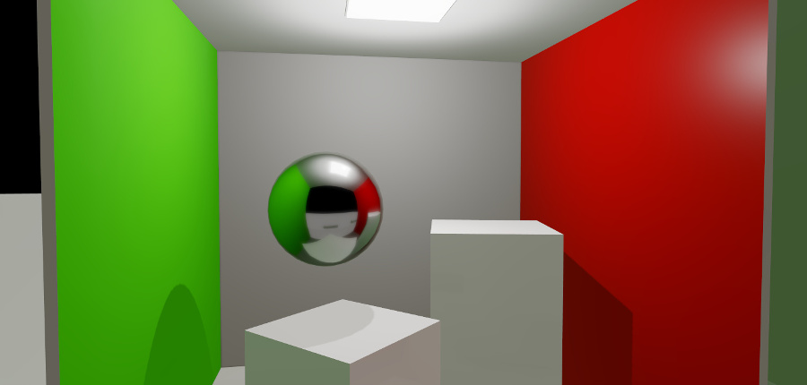
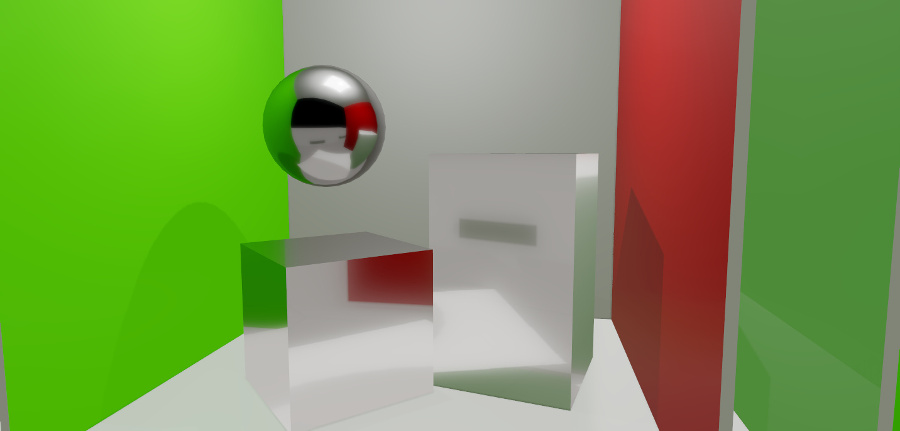
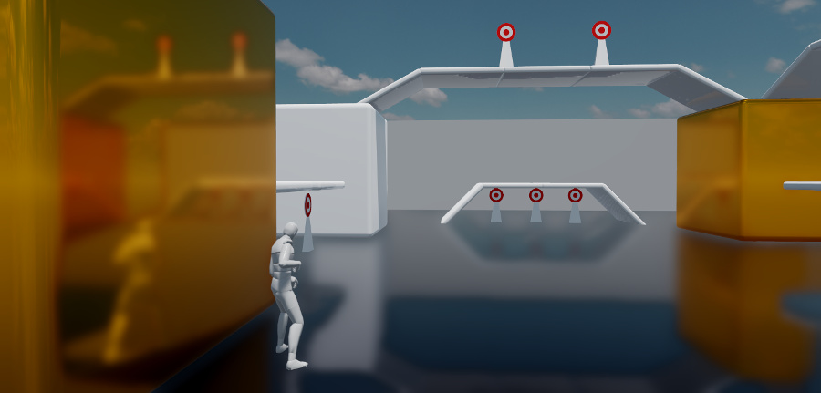
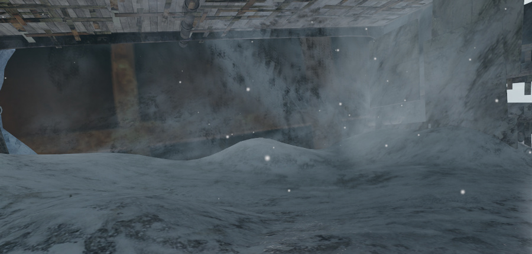

# Reflections

Almost all surfaces in the real world exhibit at least a little specular reflectivity. In the Stingray physically based rendering system, each material's *metallic* setting determines how much specular reflectivity the material shows at a given viewing angle, and its *roughness* setting determines how sharp or blurred those reflections are.

But when reflected light is needed, where do these reflections come from?

Accurately reflecting the other objects in the scene, which might themselves have reflections from other parts of the scene, involves tracing the paths of light rays around the scene over multiple bounces. Given the number of surfaces that may be involved, and how complex the interaction of their reflections can be, the calculations required for this kind of simulation are very heavy to carry out in real time in the game.

However, there are several ways you can achieve close enough approximations for reflected light in your levels. You will need to work out a good balance between these techniques for your own game. In general, keep in mind that the smoother and flatter your materials are, the harder you will have to work to make their reflections accurate enough.

Remember that non-metallic surfaces show the color of specular light unchanged. Metallic surfaces tint the light they reflect based on the material's color.

## Global specular light

In the shading environment's global light settings, you can specify a texture that will be used by default whenever an object needs to show some specular reflections. This is a single volume map, which you typically generate by placing a reflection probe at a representative location in the level and baking the reflection probe to a texture. For details on the procedure, see ~{ Global environment lighting }~.

This approach provides an easy way to set up basic specular lighting for all the surfaces in the level in a single place. If your level has relatively consistent lighting conditions, and surfaces that are not overly smooth and reflective, this may be all you need in order to give your physically based materials enough reflective light of the right color to appear plausible.

For example, in this scene, a global specular map provides highlights for the highly reflective icy ground.

The fact that this global light map applies everywhere is also the downside of this approach: often the volume map will provide an inappropriate color or level of specular light for a given place in a level. For example, if the sky is visible to the light probe that baked the global specular map, that sky will be visible in reflections even when the sky would be occluded from the surface -- surfaces that are inside buildings or under other objects. In this image, the ice shouldn't be reflecting the sky, since at this angle the sky should be occluded by the walls and ceiling:

## Placed reflection probes

You can place additional light probes into your scene beyond the one you use for your global specular lighting.

Whenever a reflective object is inside the boundaries set for a reflection probe in the level, the object's surface will use the reflection map baked by that probe instead of the global one. These localized reflection maps will usually be more accurate for objects close to the probe than the single global specular map.

For example, in this image, a probe is placed at the location of the sphere. Its baked reflections override the global specular map, to provide an accurate view of the scene from the point of view of the sphere.

In addition, if the boundaries of multiple reflection probes overlap, and a surface falls in the overlapping area, the surface will pick up both reflection maps and interpolate between them based on their relative positions. This allows moving objects with reflective surfaces to shift between the reflections baked by multiple probes, while keeping the reflections as realistic as possible at all times.

For instructions on how to set up a level with a placed reflection probe, see ~{ Set up a baked reflection probe }~.

Localized reflection probes are usually an improvement on using a single baked global specular texture. However, you can still see the same kinds of artifacts you do with global lighting, where specular reflections show up in places that no specular light can actually reach, or the reflection doesn't match the object you'd expect to see.

For example, in this image the boxes have been made very metallic, so they pick up the specular reflections baked by the probe. In this case, the reflections do not hold up: the taller box should be reflecting the red wall.

The biggest drawback of using light probes to bake reflections for your level is that the baked textures are static. The reflections they show can include only the objects that are present in the level at the time they are baked. Anything that happens dynamically over the course of the game isn't reflected. For example, if a building gets destroyed in the game, it will continue to show up in the reflections from nearby surfaces. If the changes are predictable, you may be able to get around this limitation by baking multiple sets of light probes, one set with the building present and one set with the building not present, and toggle the reflection probes from your Flow or Lua gameplay code. However, this approach does not scale well.

## Screen space reflections

Most game levels change in many different ways over time -- player characters, non-player characters and vehicles move around, particle effects start and stop, objects get created and destroyed. To make these dynamic objects show up in reflective surfaces, you can add screen space reflections: a technique that "fakes" dynamic reflections as a post-effect after each frame is rendered.

When Stingray renders a frame, it also creates a *depth buffer* -- a record of the distance from the camera to the various shaded surfaces in the frame. Using this depth information, the renderer can detect when a surface is reflecting something else that has already been rendered in the frame. It can then reflect that shaded object in the reflective surface.

Here you can see not only the static targets and ramps being reflected, but also the dynamic character:

Screen space reflections complement baked probes by adding in dynamically moving objects, and by making surfaces more accurately reflect their surroundings. They can also complement baked probes by brightening or darkening the specular highlights according to what is actually visible. For example, in this version of the image shown above, the screen space reflections dim the impossible specular highlights on the ground:

You set up creen space reflections in the shading environment. For details, see ~{ Shading environment properties }~.

However, screen space reflection is not perfect. Since it can produce very jagged artifacts, it is usually best for use with surfaces that have at least a little roughness. Purely smooth metals usually show up the imperfections too clearly.

In addition, screen space reflection by nature cannot reflect any surfaces that are not already visible elsewhere in the frame. This means that off-screen parts of objects will not be visible, not will any faces of objects that are pointing away from the camera. It also has no information about the thickness of rendered objects. Therefore, it sometimes cannot tell when background objects should be rendered if a foreground object intervenes in screen space between the reflective surface and the objects it should be reflecting. The shading environment offers some parameters that you can use to try to minimize these artifacts.

## Combining reflection sources

You can use all three approaches above in your game at the same time. The renderer applies their contributions to each pixel as follows:

-	If screen space reflections are enabled, and a screen space reflection is found for the pixel, the screen space reflection value will be used.
-	Otherwise, if the pixel falls within the bounding volume of a localized reflection probe, the renderer calculates the influence from that probe (according to its falloff setting). If the pixel falls within the bounding volume of additional localized probes, the renderer repeats this process for each other localized probe until either the total influence reaches 1 or all localized probes have been treated.
-	If the reflection influence is not yet at 1, the rest of the reflection contribution is taken from the global reflection probe set up in the shading environment.
