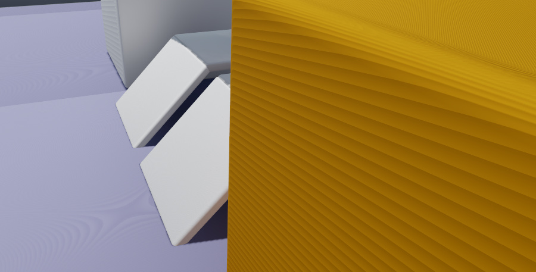
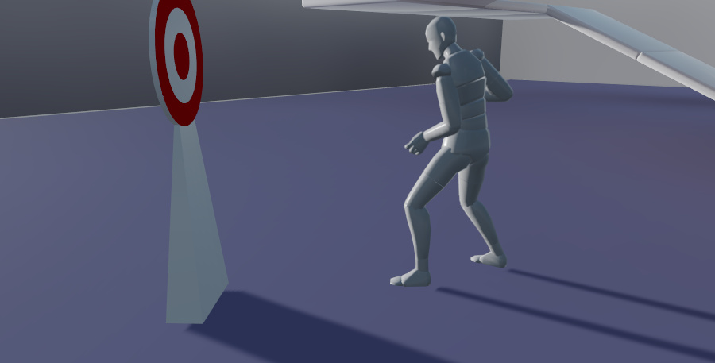

# Shadows

Shadows might seem easy to set up and manage: after all, they should just naturally appear everywhere that light isn't. However, shadows in a real-time rendered game come with their own technical concerns and limitations.

{{ProductName}} uses *shadow maps* to simulate shadows from dynamic lights. The idea behind a shadow map is that each shadow-casting light creates a *depth map* from its own point of view on the scene. This depth map records the distance from the light source to all of the places in the scene that its illumination reaches. When the renderer draws the objects in the scene from the point of view of a camera, it projects each surface into the local space of the light. It then checks the position of the surface against the light's depth map to determine whether or not that surface should be occluded from the light source.

The first directional light in the scene, which typically represents the sun, has a special type of shadow map called a *cascaded shadow map*. This is essentially a combination of multiple shadow maps, each of which handles the shadows that lie at different distances from the camera. That way, objects close to the camera can have more fine details in their shadows than objects at a distance.

>	**Note:** Only the first directional light in the level can cast shadows.

You don't have to know any of the technical details involved in shadow mapping in order to use them in your game. If you want to learn more, you can read about it on [Wikipedia](https://en.wikipedia.org/wiki/Shadow_mapping) or in [this tutorial](http://www.opengl-tutorial.org/intermediate-tutorials/tutorial-16-shadow-mapping/).

However, it should be clear that each additional shadow-casting light adds some extra performance overhead to rendering the game world in each frame. You therefore want to avoid creating shadow-casting lights unnecessarily.

{{ProductName}} has a few additional parameters that you can use to control which lights and objects cast shadows, and to set up technical parameters for shadow mapping. These are described in the following sections.

## Enabling and disabling shadows

Each light source has its own **Cast Shadows** property that determines whether or not the light's direct illumination generates any shadows at all. When this option is disabled, the light will illuminate all surfaces inside its volume of effect, even when those surfaces are occluded by another object. See ~{ Light source properties }~.

Each mesh within a unit has its own **Cast Shadows** option that determines whether or not that mesh casts a shadow when a light shines on it. To set this property, open your unit in the ~{ Unit Editor }~, select the mesh, and find the setting in the **Properties** panel of the **Unit Editor**.

In order for an object to cast a shadow, both the light and the object need to have their **Cast Shadows** property enabled.

## Shading environment settings

Global shadow quality parameters in the shading environment control the maximum shadow distance, and the sharpness of your shadows' edges. See ~{ Shading environment properties }~.

## Shadow bias

Each light has a configurable **Shadow Bias** setting, which offsets the shadow map by a small distance when applying it to the scene. Adjusting this value can help correct some common artifacts that can occur with shadow maps.

Increasing this value may help if you see flickering, banding (like on the orange cube) or "shadow acne" (moiré patterns like the ones on the floor):

Decreasing this value may help if you see "peter pan" artifacts, where the shadows of your objects appear offset or disconnected from the bases of the objects. This makes the objects appear as if they are floating above the surface.

## Render settings

The *settings.ini* file exposes some render settings that control the shadow map texture sizes and filter quality. You can try to tweak the default values of these parameters in order to trade off performance and memory usage against shadow quality.

See ~{ settings.ini file reference }~.
