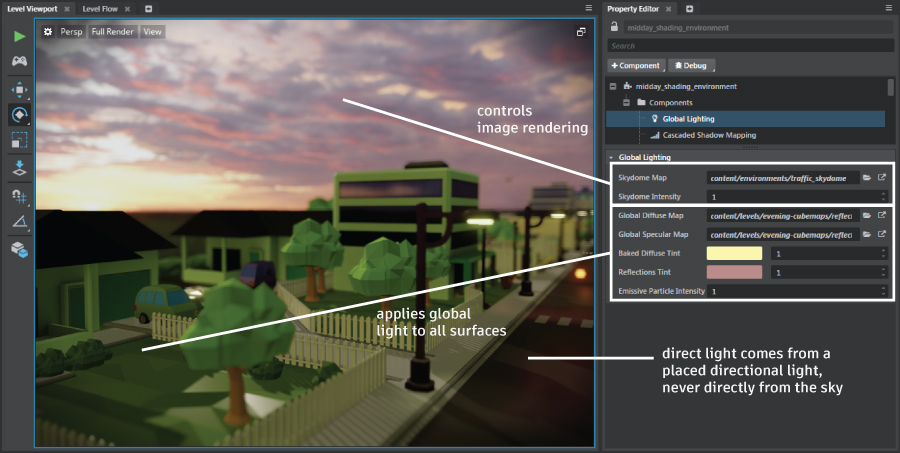

# Lighting and the sky

Every new level you create gets a skydome: a spherical unit that surrounds the other objects in the level.

Unlike most of the objects you place in your level, the skydome is always rendered against the far clipping plane of the camera, wherever it is not obscured by other objects in the way. This makes it appear equally distant no matter where you are in the level. Also unlike most of the other kinds of objects in your level, the skydome is rendered according to settings that you provide in the level's shading environment rather than materials that you set directly on the unit.

The sky contributes to the look of your level in two ways: by being drawn directly on the screen, and by providing ambient environmental lighting that affects other objects in your scene to simulate indirect lighting.

## Sky texture rendering

Wherever the sky is visible behind the other objects in your scene, it is rendered using an image texture that you set up in the **Global Lighting > Skydome Map** setting within the shading environment.

You can also set a **Global Lighting > Skydome Intensity** value, which makes the sky texture appear darker or lighter in the parts of the screen in which it is directly visible.

For details on how to set these values in your level's shading environment, see ~{ Change shading environment properties }~.

For details on creating your own skydome texture, see ~{ Create a skydome texture }~.

## Global lighting contributions

The skydome never emits light directly into your scene. Regardless of the texture you use for your skydome and the intensity value you set to control its brightness, the direct light that is actually applied to the objects in your level does not change.

However, you *can* make the skydome texture and its intensity level contribute to the lighting of your scene through global environment lighting.

To do this, you use a reflection probe to capture the diffuse and specular light in your level and bake it to two separate texture resources. Then, you set up the shading environment to use those textures. You can also use the tint and intensity controls in the Property Editor to apply some extra coloring to the baked textures.

For detailed instructions, see ~{ Global environment lighting }~.

Make sure that your reflection probe is located in a place where it captures as much of your sky texture as possible.

## Baking

If you choose to bake the lighting for your level instead of using global lighting, you can also make your skydome contribute light into the baked lightmaps. The built-in light baker offers an option in the **Light Baking** dialog for controlling the intensity of the skydome. See also the topics under ~{ Light baking }~.

## Combining the sky, the sun, and the global lighting

Lighting an outdoor scene that contains a sky involves a careful balance between the sky texture and intensity, the directional light that simulates the sun or moon, and the global environmental lighting.

Some principles to follow:

-	Align the orientation of the main directional light with the placement of the sun or moon in the sky texture, so that the light rays appear to be coming from the right direction. This makes the shadows cast by the directional light appear more realistic in context.

-	Set the color of your main directional light to match the context provided by your sky texture. For example, your sky texture might have a bright yellow sun, a silvery moon, or an orange sunset. You will likely want to tint the color of your main directional light to match the apparent source of the light within your sky texture.

-	Adjust the relative intensity of your main directional light and your global indirect lighting to match how bright you want your day to be and how much indirect scattering of light you want to simulate. For example, in a cloudless scene, you might make your directional light intensity relatively strong compared to your global lighting, in order to strengthen the appearance of direct sunlight and to make the shadows very distinct. However, with an overcast sky, you might lower the intensity of the directional light and boost the global environment light, in order to simulate more indirect bouncing of the light around the scene.

For example, the image at the top of the page shows a scene at sunset. The directional light is set so that the light appears to come from the lightest area of the skydome, at a very low angle. Because the sky is cloudy and the sun has mostly set, the indirect contributions from the global light are quite strong relative to the directional light. The extra tints on the global light boost the effect of the purple clouds and buttery sunset.

---
Related topics:
-	~{ Shading environment properties }~
-	~{ Change shading environment properties }~
-	~{ Global environment lighting }~

---
