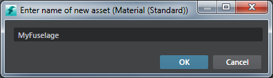

# Create a material

Though it is most common to use materials that are already created and assigned to objects, there are times when you want to create materials separately.

For example, if you're working with many objects that use a common material, creating a separate material and assigning it manually to the respective objects can be both easier and more efficient.

**To create a new material with standard features:**

1.	In the **Asset Browser** (**Window > Asset Browser**), navigate to the folder where you want to create the material.

	For example, you could create a folder called "Common Materials" in your project. The name and file structure is important only for your own organization.

2.	Right-click in your materials folder and select **Create > Material (Standard)**.

3.	Enter an appropriate name for the material and click **OK**.

	

	This creates a new child material that points to the default, standard material. (The standard material is its parent.) The child material properties display in the ~{ Property Editor }~.

4.	To connect maps such as color, normal, and roughness, select the material and open the ~{ Property Editor }~. Here, you can do one of the following:

	- Browse to select the map you want, then enable the 'Use ... Map' check boxes to see the effect of the textures. See ~{ Edit a child material }~ and ~{ Standard material properties }~ for more details.
	- Drag and drop a texture from the **Asset Browser** to any of the map fields.

	> **Note:** If all you want to do is change these attributes for the material (connect new maps using the **Property Editor**), you don't need to create a parent material. You only need to create a new parent material if you want to change the underlying shader graph, for example to combine two textures, or add nodes to the graph. See ~{ Create a parent material }~.

**To create a new empty material for customization**

(Use these steps if you are an advanced user and you want to create a custom shader graph.)

1.	In the **Asset Browser**, navigate to the folder where you want to create the material.

2.	Right-click in that folder and select **Create > Material (Empty)**.

	This creates a new material that contains only one **Output > Standard Base** node by default.

3.	In the **Property Editor**, click . Use the **Shader Graph Editor** to create and connect nodes and build the custom material you want. See ~{ Create or edit shader graphs }~.

---
Related topics:
- ~{ Edit a child material }~
- ~{ Create a standard transparent material }~
- ~{ Create a parent material }~
- ~{ Parent and child materials }~
---
