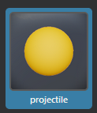
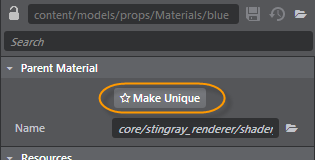

#Create a parent material

{{ProductName}} ships with several standard materials that provide many features, but you can also use these steps to create and optimize your own material graphs.

> **Note:** This is an advanced workflow that creates an entirely new parent material with a unique shader graph. See ~{ Create a material }~ for the basic workflow of creating a new child material.

1. In the **Asset Browser**, navigate to select an existing material, or create a new one.

	

2. In the **Property Editor**, click **Make Unique**.

	

	This creates a new parent material with a unique shader graph.

3. Click  to open the ~{ Shader Graph Editor }~.

	This parent material graph defines which properties are exposed for instances of this material in the **Property Editor**.

4. Edit the graph.

	Refer to ~{ Shader Graph Editor }~ for tips on working with this editor, as well as the shader node reference. For example, right-click and select **Add > Output > Standard Base** to add the first node.

	As you add, edit, and connect nodes, periodically click an empty area of the graph view (ensuring no individual nodes are selected) so that you can see how the material will display in the **Property Editor**.

5. Set the default material properties in the **Property Editor**, and save the material.

	As you create and edit materials, a data compiling message sometimes displays in the Status bar.

	

	This message displays as the engine works in the background to create the shader permutations for each material that you might need in game.

---
Related topics:
- ~{ Parent and child materials }~
- ~{ Create a material }~
- ~{ Assign a material to an object }~
---
