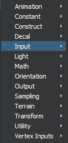

# Create or edit shader graphs

Use the ~{ Shader Graph Editor }~ to load, edit, and save the shader graphs that make up the parent materials for your project.

- To load and edit an existing shader graph, double-click a parent material in the **Asset Browser**, or select a parent material then click **Open Graph Editor** in the **Property Editor**. See also ~{ Create a parent material }~.
- To start with a new, empty graph, create an empty material (see ~{ Create a material }~). Select the empty material and click **Open Graph Editor** in the **Property Editor**.

> **Tip:** To streamline your workflow, you can dock multiple shader graphs in the main interface. With several shader graphs open at once, you can easily cut and paste shader nodes between different graphs.

##Building a graph

|  To:   | |
|----------------------------|-----------------|
| Create a node | Right-click in the graph view area, select *Add*, then select the type of node you want.   |
| Add nodes by name | Press Tab, then search and select from the node browser that pops up.  |
| Search for text or node | Use the *Search* field and browse through the results using the arrow keys. |
| View help on a specific node | Select the help icon on the node. |
| To edit which channels are used (Component Swizzle) (eg. RGB) | Double-click the connection. In the pop-up window, enter the channels you want. (eg. RGG)|
| Change output when there is no connection  | Click pencil icons to edit.   |
| View node properties  | Select the node and view the **Property Editor**.  If you select nothing, you see properties of entire material.    |
| View properties for entire material | Deselect all nodes and view the **Property Editor**.  |

> **Tip: **As you work on a shader graph, periodically deselect all nodes to preview how the shader will look in the **Property Editor**.

##Editing nodes

Editing nodes in the **Shader Graph Editor** is very similar to editing nodes in the ~{ Level Flow Editor }~.

You'll use the material graph view to connect nodes to form a network that connects into the main Standard Base (PBR) node in the graph.

|  Node editing hotkeys    |
|----------------------------|-----------------|
| Frame selected node(s) in graph view | F |
| Frame entire graph | A  |
| Spawn the node browser at your cursor | Tab  |
| Cut nodes | Ctrl + X  |
| Copy nodes | Ctrl + C  |
| Paste nodes | Ctrl + V  |
| Group nodes | Ctrl + G  |
| Delete nodes | Delete  |
| Undo | Ctrl + Z  |

**Note:** Once you create a group of nodes, you can expand, collapse, and rename the group.

##Navigating in the **Shader Graph Editor**

|  Navigation hotkeys    |
|----------------------------|-----------------|
| Pan | Middle-drag or Alt + middle-drag |
| Zoom | Scroll wheel or Alt + right-drag  |

## File operation in the **Shader Graph Editor**

|  File operation hotkeys  |
|-----------------------------|------------------|
| Open a material shader graph  |  Ctrl + O  |
| Create an empty shader editor |  Ctrl + N  |
| Save the current shader graph |  Ctrl + S  |
| Save the shader graph as a new one |  Ctrl + Shift + S |
