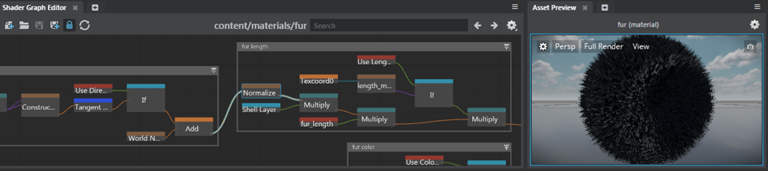

# Shader Graph Editor

- **Window > Shader Graph Editor**

The **Shader Graph Editor** is a hub where technical artists and shader writers can load, edit, and save material graphs across a project. See also ~{ Create or edit shader graphs }~. For more information about all built-in shader nodes, see the [Shader Node Reference](../../../../shaders_ref/index.html).

To load a shader graph in the **Shader Graph Editor**:

- Double-click a parent material in the **Asset Browser**.
- Select a parent material and click **Open Shader Graph** in the **Property Editor**.

If you'll be doing a lot of work with shader networks, you can dock the **Shader Graph Editor** in the main interface, for example, next to the **Level Flow** tab. As you edit the shader graph, the **Asset Preview** window updates to display your changes. Save the material to force a refresh if necessary.

To streamline your workflow, you can dock multiple shader graphs in the main interface. With several shader graphs open at once, you can easily cut and paste shader nodes between different graphs.

|  Navigation hotkeys    |
|----------------------------|-----------------|
| Pan | Middle-drag or Alt + middle-drag |
| Zoom | Scroll wheel or Alt + right-drag  |

|  File operation hotkeys  |
|-----------------------------|------------------|
| Open a material shader graph  |  Ctrl + O  |
| Create an empty shader editor |  Ctrl + N  |
| Save the current shader graph |  Ctrl + S  |
| Save the shader graph as a new one |  Ctrl + Shift + S |

---
Related topics:
- ~{ Create a parent material }~
- ~{ Standard material properties }~
---
