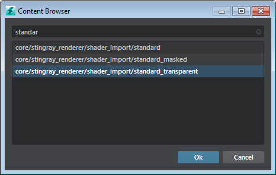

# Create a standard transparent material

To use transparent materials in {{ProductName}}, you must convert your material from a standard material into a standard transparent material. The standard transparent material is the same as the standard material, except that it provides an Opacity channel.

1. In the **Asset Browser**, navigate to select an existing material, or create a new one. (See ~{ Create a material }~).

2. In the ~{ Property Editor }~, click the Browse icon next to **Parent Material**.

	

3. In the **Content Browser** window, start to type “Standard Transparent” in the Search field, then select the standard_transparent material from the list.

	

For the selected material, this changes its parent material to the standard transparent material.

> **Tip:** To make transparent materials refract the opaque objects behind them, use the refraction input on the material.

---
Related topics:
- ~{ Parent and child materials }~
---
