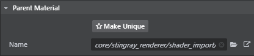

# Edit a child material

The properties available in the ~{ Property Editor }~ for editing a child material are determined by the shader graph of its parent material. For example, the {{ProductName}} physically-based shader graph provides the ~{ Standard material properties }~.

See ~{ Parent and child materials }~ for more information on this concept.

**To edit material properties:  **

1. In the **Asset Browser**, select a material.

2. With the material selected, open the **Property Editor** (**Window > Property Editor**).

3. Make any adjustments needed.

	When you edit the material properties of a child material, they turn blue in the **Property Editor**, to show that they are different from the parent material. You can click any blue label to instantly reset the property to the parent default value.

	

	Depending on your editor layout, the material name, the **Asset Preview** window, or a small disk icon display in orange to indicate you have unsaved changes on the child material.

	

4. Do either of the following to save the material:

	- In the **Asset Browser**, right-click on the material and select **Save**.
	- In the **Property Editor**, click the save icon 

> **Note:** You can save changes individually or save all edits by selecting **File > Save All** from the main menu bar.

##Change the parent material

**Parent Material** is the first property listed for every material in the **Property Editor**.

The parent material determines the properties that are available for all instances of a material in the **Property Editor**, so changing the parent material can change the rest of the properties you see.

For example, to change a material that uses the "standard" material as its parent to instead use the "standard transparent" material:

1. In the **Property Editor**, click the **Select resource** icon  next to **Parent Material**.

	The **Content Browser** displays, which lists all possible materials in your project, including all child materials.

2. In the **Content Browser**, start typing in the **Search** field to narrow the listings, and select the new parent material.

	

---
Related topics:
- ~{ Assign a material to an object }~
- ~{ Create a material }~
- ~{ Create a parent material }~
---
