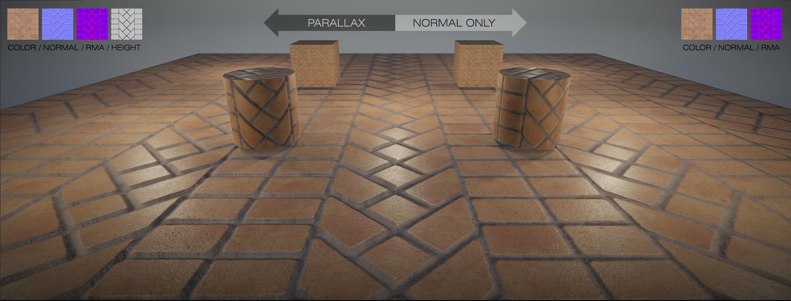
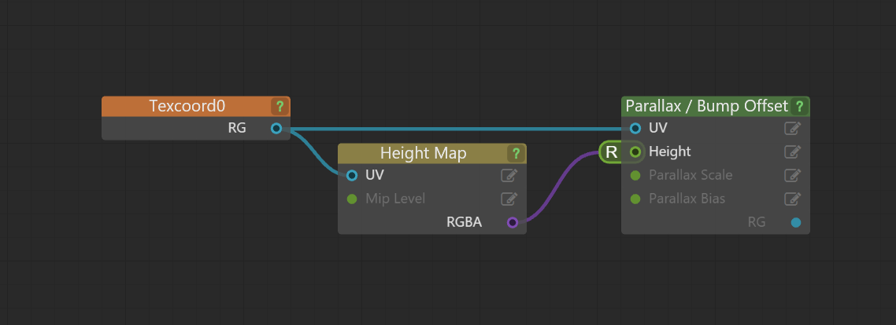
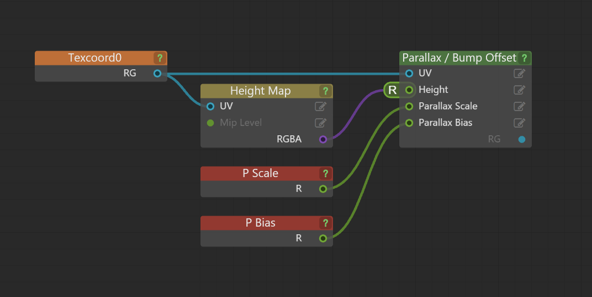
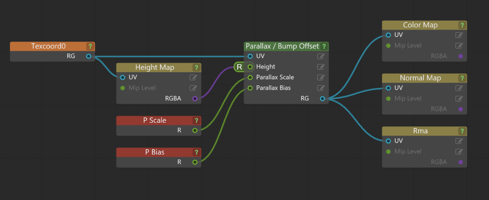
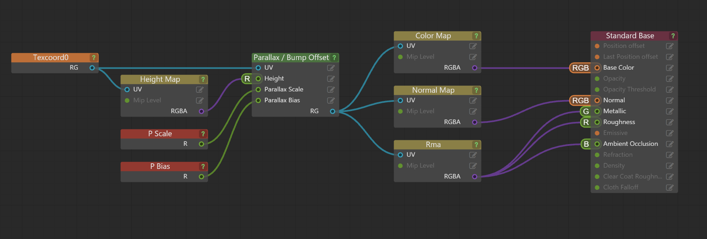
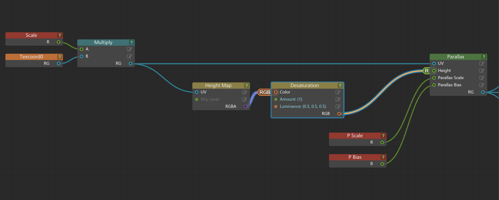
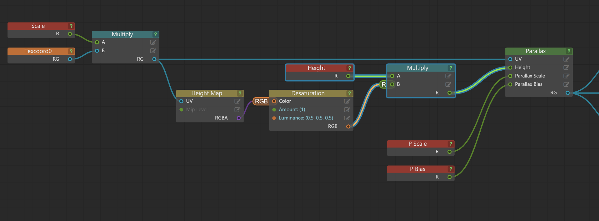
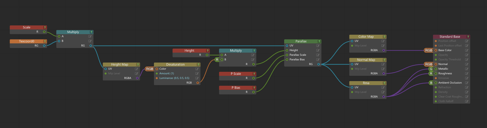
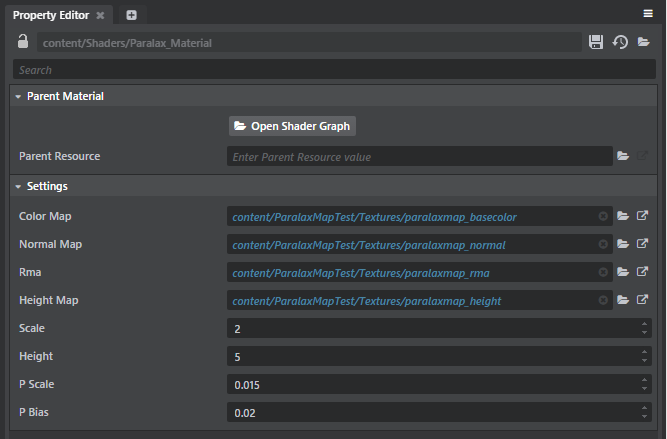

# Parallax mapping

>  Visit the AREA for <a href="http://area.autodesk.com/learning/parallax-mapping-in-stingray" target="blank">a video tutorial on Parallax mapping.</a> This tutorial also includes a link to download a sample parallax shader.

## What is parallax mapping?

Parallax mapping is a technique used by 3D graphics engines to increase the apparent depth of a texture beyond what a normal or bump map could do. Similar to normal mapping, parallax mapping is calculated in tangent space.  By using a combination of the diffuse/albedo, height map, and the normal map, the shader self-highlights and self-shadows the material while performing offsets to give a more dramatic and believable depth to the surface.

## Why use parallax mapping?

Parallax mapping gives the advantage of simulated depth at a lower cost (in terms of memory, processor/GPU calculations) over adding model detail, and can often be far quicker to produce good results.

## How do I set up a parallax map shader?

Parallax mapping is quite easy to set up using the Parallax node in the ~{ Shader Graph Editor }~. See the below illustration for an example.

To begin, you want to drive the parallax and height map from the texture coordinate.

Next, add some basic controls by adding scalar material variables.

Now that the Parallax node is properly fed, add Sample Textures (Texture Maps) with the Parallax adjusted texture coordinates.

Lastly we add in the Standard Base and attach everything up.

## Adding more flexibility and accuracy to the shader

In order to ensure your red channel is equal to your green and blue channel, add a desaturation node with an Amount of 1 and a luminosity of .5 .5 .5.

Then add a multiplier to the height map with a scalar adjustment. This lets you drive the height map with greater or lesser contrast for additional control over the parallax inputs.

In final form, this is how your shader should look.

In use, the shader should have controls and output like the following image.  Note the properties window where you now have inputs for the separate textures (BaseColor, Normal, RMA, and Height) and adjustment controls for Height, P Scale, and P Bias.

