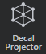

# Project a material as a decal

*Decals* project color textures, normal maps and emissive color effects onto the meshes in your levels.

You can use decals to achieve a wide variety of effects. For example:

-	Enhance the look of your level by scattering subtle atmospheric overlays to simulate things like frost, stains, and shadows.
-	Tie the objects in your level together visually by projecting overlays across the boundaries between the models.
-	Disguise mesh instancing by giving unique features to each instance of a copied unit or to each block of a repeating texture.
-	Make game events appear to alter the static objects in your scene by dynamically spawning projectors for marks like footprints, bullet holes, bloodstains, and so on.

The image above shows a plain white wall enhanced in the level by several decals: a normal map for the brick texture, two semi-transparent color fills, color textures with alpha transparencies, and bullet marks that add both color and normal information.

## Step 1. Create a decal projector

Decals are usually projected using a decal projector unit, which is provided in the core resources folder, at `core/stingray_renderer/helper_units/decals/decal_box`.

To create a new decal projector in a level:

1.	Open the ~{ Create panel }~.

2.	In the **Rendering** category, select the **Decal Projector** icon to activate the **Place** tool.

	

3.	Click a location in your level to place a new projector volume. While the **Place** tool is active, you can add as many volumes as you need.

4.	When you are done, click the **Decal Projector** icon again, or switch to a different viewport interaction tool.

## Step 2. Create a new material to project

Each new decal projector uses a default material that comes from the core resources. This placeholder projects the debug texture for missing textures: a question mark on a yellow background. You will want to create a new material for your decal, and set it up to project your own texture.

1.	In the ~{ Asset Browser }~, navigate to the folder where you want to keep your new material.

2. Right-click the folder in the **Asset Browser**. From the contextual menu, select **Create > Material (Empty)** or **Create > Material (Standard)**.

3.	Enter a name for your new material and click **OK**.

4.	Select the material in the **Asset Browser**, and open the ~{ Property Editor }~ to view its properties.

5.	Under the **Parent Material** group, set the **Name** field to point to the default decal material, `core/stingray_renderer/helper_units/decals/decal`.

	This sets up the material so that any mesh it applies to will be shaded as a decal projector instead of as a normally lit mesh.

6.	Setting the parent material also exposes a new **Color Map** property in the **Property Editor**. Use this setting to replace the default question mark color texture with the decal image that you want to apply. The color and alpha values of the projected texture are drawn from the texture you set here.

If you want to project a normal map or emissive texture, you will need to modify the material's shader graph. See [below](#optional-customize-the-material-shader-graph).

## Step 3. Apply the new material to the projector

1.	Select the projector in the level, and open the ~{ Property Editor }~ to view its properties.

2.	Under the **Materials** group, set the projector's **decal** material slot to point to your new material.

## Step 4. Move, scale and orient the projector

The projector applies its decal only to meshes that intersect its volume. You can control which meshes receive the projection by moving and scaling the projector unit so that it intersects the meshes you want to project on.

The texture is always projected orthogonally along the local forward axis of the projector box (the green arrow in the gizmo below), with the top of the texture aligned in the direction of the local up axis of the projector box (the blue arrow). By rotating the projector around its forward axis, you can turn the projection sideways or upside down.

The texture is also projected along the negative direction of the forward axis, but flipped horizontally. You can reverse your texture by turning the projector to face *away* from the intersecting mesh.

The projected texture is scaled to fit the dimensions of the projector unit along its local right and up axes. By manipulating the scale of the projector box along these axes, you can change the ratio between the width and height of the texture being projected.

By rotating the projector to change the angle of incidence between it and the meshes it is projecting on, you can control the "skew" of the projection.

## Optional: Customize the material shader graph

If you want to project normals or emissive textures, or change the way the color texture input is interpreted, you can modify your material's shader graph.

1.	Select your material in the **Asset Browser**, and open the ~{ Property Editor }~ to view its properties.

2.	In the **Property Editor**, click the **Make Unique** button. This will detach your material from its parent and make it editable.

3.	Click the **Open Shader Graph** button, or double-click your material in the **Asset Browser**.

This opens the ~{ Shader Graph Editor }~ with your material's graph loaded. You can re-wire the material nodes as needed. For example, the following graph adds the ability to set a normal map and map opacity for the material through the Property Editor. The alpha channel from the normal map is passed into the **Mask** input of the **Decal Base** node in order to prevent flat areas from conflicting withm surface normals added by other decals.

<!-- TODO: See also the topics under shader graphs -->

## Optional: Create a custom decal projector unit

You can make any unit into a decal projector by setting it to use a material whose shader graph uses the **Decal Base** output node. The decal projector unit in the core resources that you place from the **Create** panel is simply a cubic mesh preset to use a decal material. But there is nothing else special about it.

If you often need to project the same textures in many places, you may find it convenient to set up your own custom decal helper unit instead of using the default one.

One easy way to do this is to open the base decal box unit in the **Unit Editor**, and re-save it with a different resource name. You can even preset it to use the material you want to project so that you have less tweaking to do when you spawn the unit in your level.

## Spawn decal projectors dynamically

Since a decal projector is fundamentally just a unit, you can spawn and unspawn decal projectors dynamically at runtime in your game in Flow or in Lua, exactly the same way you would spawn and unspawn other kinds of units. You will need to place and size the unit so that it projects on the meshes that you want it to, and you may need to set up the unit to project the right material.

For example:

~~~{lua}
-- spawn the unit
local my_projector = stingray.World.spawn_unit(SimpleProject.world, "core/stingray_renderer/helper_units/decals/decal_box")
-- set a new material for the decal slot
stingray.Unit.set_material(my_projector, "decal", "content/materials/my_texture")
-- move, scale, resize
stingray.Unit.set_local_position(my_projector, 1, wanted_position)
stingray.Unit.set_local_rotation(my_projector, 1, wanted_rotation)
stingray.Unit.set_local_scale(my_projector, 1, wanted scale)
...
-- unspawn the unit
stingray.World.destroy_unit(SimpleProject.world, my_projector)
~~~

<!-- TODO: See also the topics about working with materials dynamically -->

## Limitations

-	Decals always project onto all intersecting meshes, even dynamic units that move through the projector's volume at runtime. There is currently no way to exclude certain meshes or units from the projection.
-	Decals do not project onto transparent surfaces.
