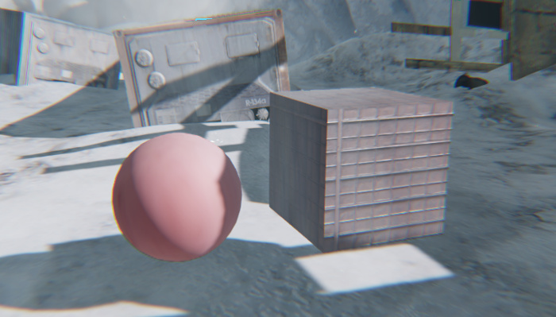
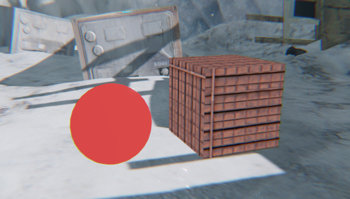

# Unlit materials

Sometimes you may want to render an object in the engine viewport without lighting and shading the object naturally as a part of the scene. To do this, you can create an *unlit* material for the object.

Objects with unlit materials are rendered and visible, but they are completely unaffected by light, and they do not cast or receive shadows. They are drawn with a flat shading that looks the same regardless of the dynamic lighting and global sky lighting present in the scene.

For example, the cube and sphere floating in this scene use standard physically based materials, with a frost texture applied on top as a decal:

In the following image the same objects are set to use unlit materials. Note that they cast no shadows either on themselves or on each other, they are evenly lit on all sides regardless of the lights in the scene and the shading environment, and they do not receive decals.

You might want to use unlit materials in order to draw 3D objects that you intend the player to use as manipulation widgets. Another common example of an object whose rendering does not depend on the light in the scene is the default skydome material. The skydome's shading depends only on the texture and other settings that are set up in the shading environment. The skydome does not cast or receive shadows, and does not change the way it looks depending on the lights you set up in your scene.

**To create an unlit material:**

1.	Create a new material asset in your project. See ~{ Create a material }~.

1.	Make the new material unique, and edit its shader graph. See ~{ Create a parent material }~.

1.	Delete the default output node from the shader graph, and replace it with the **Output > Unlit Base** output node.

	Pay particular attention to the options available in the Property Editor when you select this node. Follow the link above to the node description for details on all the available settings.

1.	Set up the rest of the graph to provide the output node with the values you need.

---
Related topics:
-	~{ Assign a material to an object }~
-	~{ Shader Graph Editor }~

---
