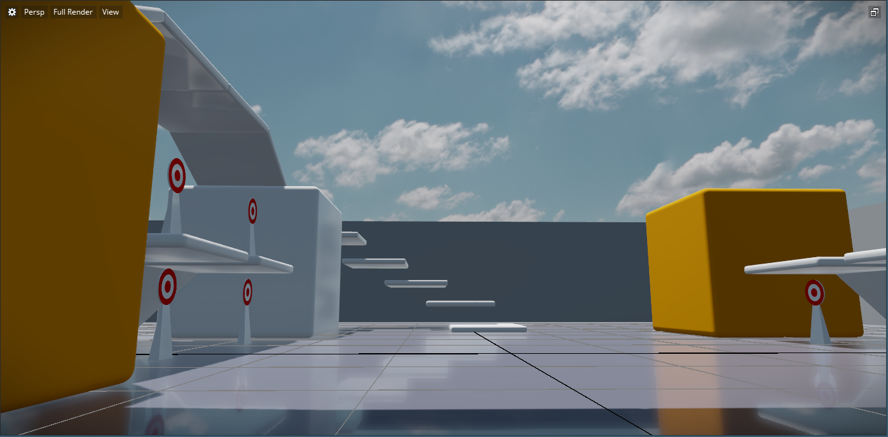
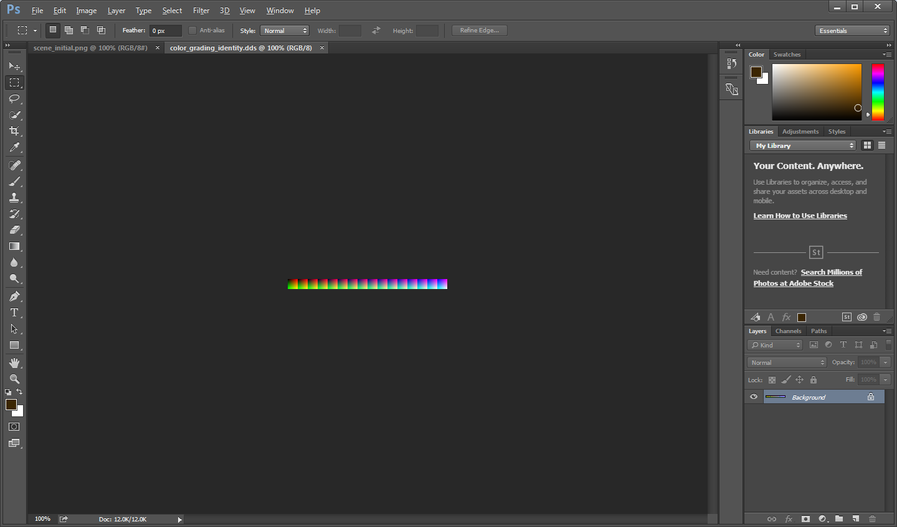
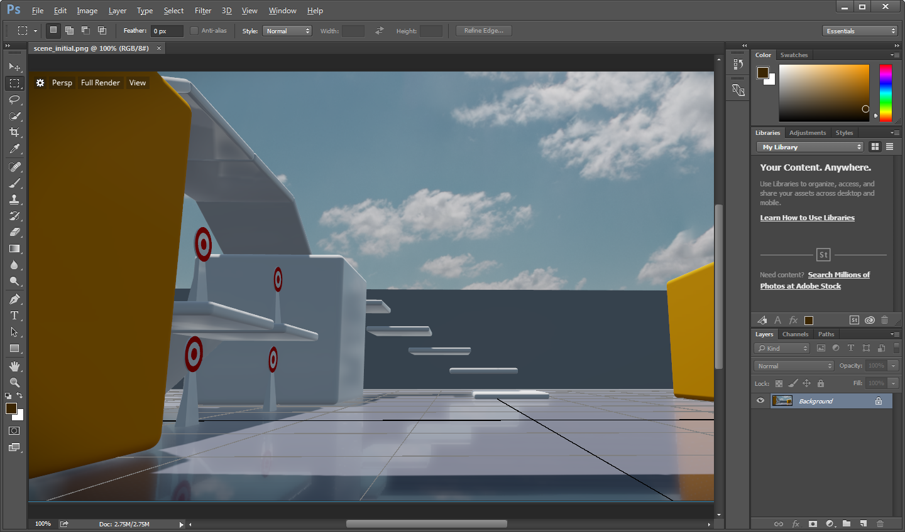
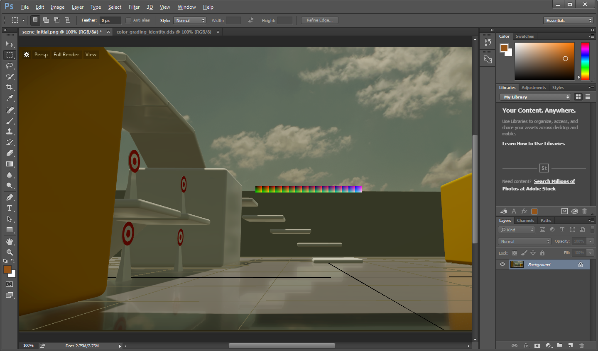
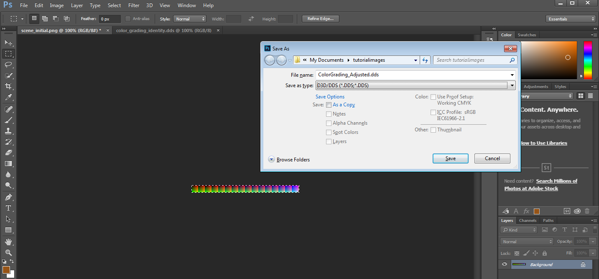
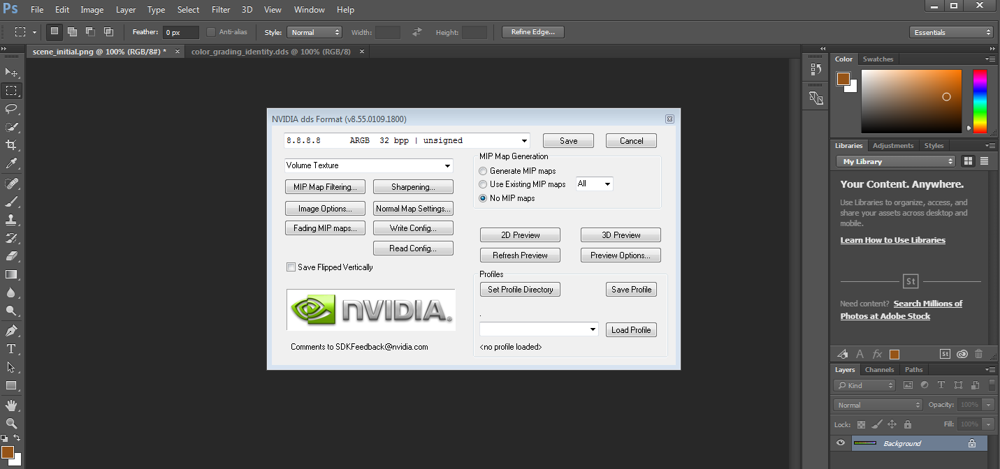
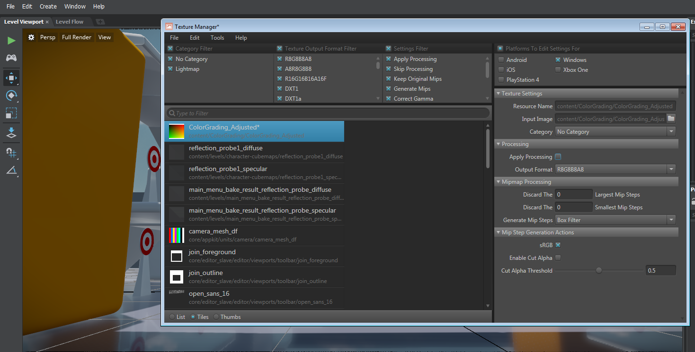
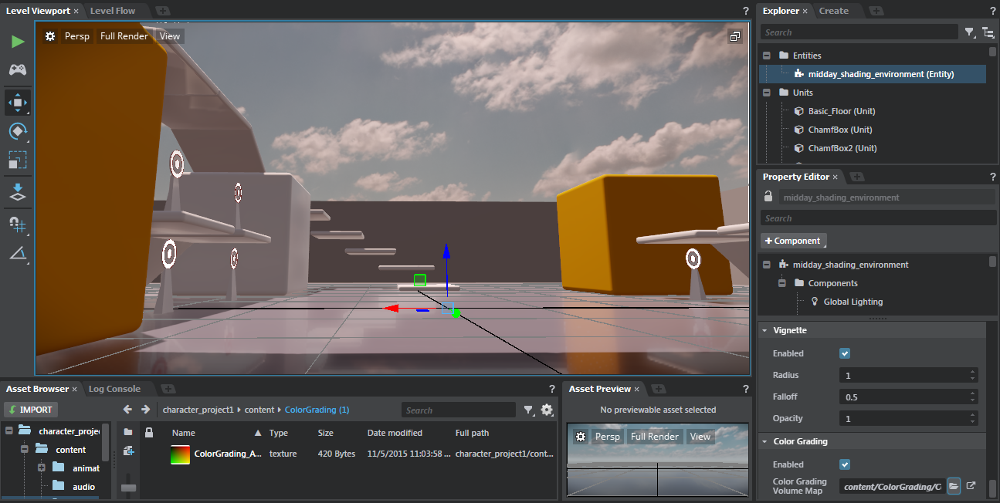

# How to apply color grading to a level

Color grading in {{ProductName}} is a post-processing operation that adjusts the colors of the image being rendered in the viewport each frame to fit into an output color space that you provide. You can use color grading to apply adjustments to color balance, brightness and contrast, hue, and saturation across your whole level.

You set the output color space as a texture resource in the shading environment. The steps on this page show how to produce a texture resource that defines an output color space. You'll start from a built-in base "identity" color space, adjust its colors in Photoshop, and re-import the adjusted color space into a new texture resource.

>	**Note:** You'll need to have access to Adobe Photoshop, along with the [NVIDIA Texture Tools](https://developer.nvidia.com/nvidia-texture-tools-adobe-photoshop) plug-in, in order to open and save DDS files in the right format.

## Step 1. Take a screenshot of your level

1.	In the editor, open the level where you want to apply color grading adjustments.

1.	Adjust your view in the **Level Viewport** until you have a good, wide field of view on your scene.

1.	Take a screenshot image of your scene and save the file.

	

## Step 2. Combine and adjust files in Photoshop

1.	In Photoshop, open the base color grading file, which is located in your core resources at `core/stingray_renderer/environments/color_grading_identity.dds`. This file defines a basic ARGB color space that leaves output colors unchanged when used as the color grading volume map for a level's shading environment.

	

1.	Open the screen capture image of your level that you created earlier.

	

1.	Copy everything from the color grading identity file (`Ctrl + A` then `Ctrl + C`), then paste it (`Ctrl + V`) into the screen capture image file.

	The color grading image is added as a new layer on top of the screen capture.

	You can move the bar to the top or bottom so as not to interrupt your view of the scene, but make sure that the entire color grading bar is visible.

	

1.	Merge the layers.

1.  Use the tools provided by Photoshop to adjust the colors in the image to suit the look you want.

	

## Step 3. Create a new file with the color grading bar

1.	Still in Photoshop, use the rectangular marquee tool to select the color grading bar as exactly as you can. Zoom in close to ensure you have an accurate selection. Make sure the selection is exactly 256 pixels by 16 pixels.

1.  Select **Image > Crop** to crop the document to your selection.

1.	Select **File > Save As**, then do the following in the **Save As** window:

	-	Select `D3D/DDS` as the file type.

	-	Give the file a different name, such as `ColorGrading_Adjusted.dds`, and save it in a different location.

		

	- 	In the DDS Options, set the format to `8.8.8.8 ARGB`, ensure the **Type** is set to **Volume Texture**, and select the **No MIP maps** option.

		

	-	Save the file..

## Step 4. Import the color grading file

1.	In the interactive editor, import the adjusted *.dds* file you created as a new texture resource. See ~{ Import textures }~.

1.	Double-click the texture resource in the **Asset Browser** to launch the ~{ Texture Manager }~.

1.	In the **Texture Manager**, select the file if it is not already selected.

7.	Under the **Processing** heading on the right, ensure that **Apply Processing** is turned off.

	

8.	Close the **Texture Manager** and click **Save** when prompted.

## Step 5. Apply the color grading file to your level

1.	In the ~{ Explorer panel }~, find and select the shading environment entity.

1.	In the ~{ Property Editor }~, find the **Color Grading** category.

1.	Click the folder icon next to **Color Grading Volume Map** and select your adjusted color map texture.

1.	Check the **Enabled** option. The viewport should now apply the same color adjustments that you made to the screen capture in Photoshop.

	

	> **Tip:** If you do not immediately see a change to the scene, restart the level (**Edit > Level Testing > Test Level**) to ensure the file is activated.
