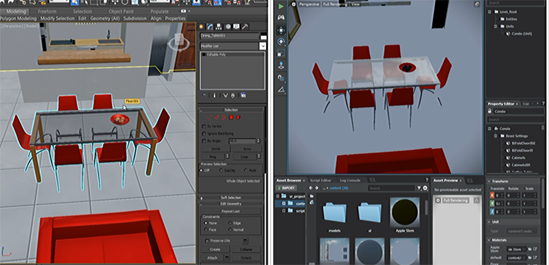

# Linking with {{ProductName}}

3ds Max Interactive Live Link is a powerful connection between 3ds Max and the 3ds Max Interactive engine that streamlines your 3D asset creation process and lets you create interactive architectural visualizations.

The 3ds Max Interactive Live Link provides the following:

-   An integrated workflow to seamlessly send assets between 3ds Max and 3ds Max Interactive and update the shared contents. See ~{ Send assets to 3ds Max}~ and ~{ Receive assets from 3ds Max }~.
-   Level sync workflows that let you send 3ds Max scenes to 3ds Max Interactive, exactly replicating your 3ds Max layout in the interactive viewport. See ~{ Level Sync with 3ds Max }~.
-   Viewport synchronization so you can quickly verify how models, animations, and materials appear in the Interactive viewport while you work in 3ds Max, see ~{ Connect 3ds Max and {{ProductName}} viewports }~.
-   Visual parity where any material created with 3ds Max Interactive (Stingray) physically-based nodes in ShaderFX are preserved when loaded in 3ds Max. See ~{ Send a material to 3ds Max}~ and ~{ Receive materials from 3ds Max }~.

  

Live linking between 3ds Max and the 3ds Max Interactive is enabled by an interop plug-in called DCC Link, which is automatically installed in your `C:\ProgramData\Autodesk\ApplicationPlugins` directory when you install 3ds Max Interactive. This plug-in also adds an *Interactive* menu in the 3ds Max menu bar.

## Troubleshoot interop plug-in installation

If 3ds Max fails to discover the link to 3ds Max Interactive, you can try the following:

**Manually install the interop plug-in:**

1. Double-click `DCCLink.msi` located here within your 3ds Max Interactive install directory: `\ProgramFiles\Autodesk\ {{ProductName}}\version\extras`. Click Install Now.

   The plug-in installer runs, and a 'Success' message displays when the install is complete.

2.  Open 3ds Max, and add `C:\ProgramData\Autodesk\ApplicationPlugins\InteractiveDCCLink_Max2018.bundle\Contents\plugins` to **Customize > Configure System Paths > 3rd Party Plugins**.

**Point {{ProductName}} to where you have the 3ds Max installed:**

The 3ds Max Interactive editor automatically detects 3ds Max if you installed it to the default location. If you installed it to a custom location, do the following to point the editor to the application.

1. In the {{ProductName}}, select **File > Settings > Editor Settings**.
2. In the **Property Editor**, navigate to select the .exe file (3dsmax.exe) wherever you installed 3ds Max.
